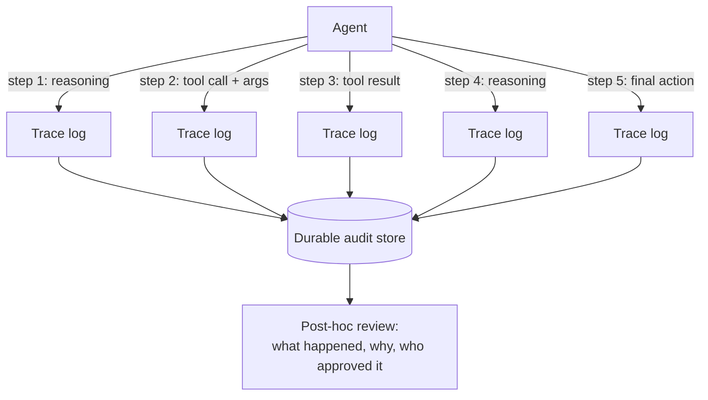

# Audit & Observability

Even with sandboxing, policy enforcement, and output validation all in
place, something will eventually go wrong or look surprising -- and when
it does, someone needs to reconstruct exactly what the agent did, why,
and in what order. That's audit and observability.

## What It Is

- **Observability**: the ability to see what an agent is doing while
  it's happening (or shortly after) -- its reasoning steps, the tools it
  called, the arguments it passed, the results it got back.
- **Tracing**: capturing the full sequence of an agent's steps as a
  structured, ordered record (often literally called a "trace") --
  analogous to distributed tracing in traditional microservices, but
  tracing a chain of *reasoning and tool calls* instead of network
  requests.
- **Audit trail**: a durable, tamper-resistant log of what actions were
  actually taken, by which agent/version, under whose authorization,
  with what result -- built for accountability and after-the-fact
  review, not just live debugging.
- These overlap but serve different purposes: observability is mostly
  for *engineers debugging behavior in the moment*; an audit trail is
  for *anyone (including non-engineers, auditors, or regulators)
  answering "what happened and who allowed it" after the fact*.

## How It Works

- A useful trace captures, at minimum: the input/prompt, each
  intermediate reasoning step (if the agent exposes one), every tool
  call with its exact arguments, every tool result, and the final
  action/output -- with timestamps and a stable identifier tying it all
  to one run.
- The audit trail is typically append-only and stored separately from
  the live system (so a compromised or malfunctioning agent can't
  retroactively edit its own history), and includes *authorization
  context* -- which policy allowed this action, and whether a human
  approved it (see [human-in-the-loop](human-in-the-loop.md)).

## What Goes Wrong Without It

- An agent takes an unexpected, consequential action (e.g. modifies a
  configuration value) and nobody can reconstruct *why* -- was it
  following a reasonable-looking but wrong instruction, was it
  responding to a malicious input, was it a genuine model error? Without
  a trace of the intermediate reasoning and tool calls, this becomes
  pure speculation.
- A multi-agent pipeline (one agent researches, another summarizes,
  another drafts a report) produces a wrong final answer, and because
  only the final output was logged -- not each intermediate agent's
  contribution -- there's no way to tell which stage introduced the
  error.
- A security or compliance review asks "show us every action this
  agent took involving customer PII in the last quarter," and the team
  discovers logging was inconsistent, incomplete, or mixed in with
  unrelated debug output -- making the audit effectively impossible to
  produce on demand.
- An agent's behavior seems to have quietly changed after a prompt
  update, but without historical traces to compare against, there's no
  concrete evidence to confirm the regression or diagnose its cause --
  just an intuition that "it feels different now."

## Current Landscape (2026)

- **LangSmith** -- a tracing and observability platform built around
  LLM/agent applications, capturing full run traces (prompts, tool
  calls, intermediate steps) for debugging and evaluation.
- **Arize (Phoenix)** -- an observability platform focused on ML/LLM
  applications, including agent tracing, drift detection, and
  production monitoring dashboards.
- **Helicone** -- a lightweight observability layer that sits in front
  of LLM API calls, logging requests/responses/costs/latency, often
  used as a simpler first step toward full tracing.
- Many teams also build on general-purpose distributed tracing
  standards (e.g. OpenTelemetry) extended with agent-specific
  attributes, rather than adopting an agent-specific tool exclusively.

## Why It Matters Long-Term

- This is the direct descendant of logging, monitoring, and distributed
  tracing in traditional software -- disciplines that didn't fade away
  as systems matured, but became *more* essential as systems grew more
  complex and distributed. Multi-step agentic reasoning is, if
  anything, harder to reconstruct after the fact than a typical
  microservice call chain, because the "logic" living inside a model's
  reasoning isn't code you can just read -- it has to be captured as it
  happens or it's gone.
- Regulatory and compliance pressure on autonomous systems is only
  increasing, not decreasing -- "we can't tell you why the agent did
  that" is not going to be an acceptable answer to a regulator, an
  auditor, or an affected customer, in the same way "we don't keep
  logs" isn't acceptable for a bank today.
- Audit trails are also what make every *other* governance layer
  trustworthy in retrospect -- they're the evidence that policy
  enforcement actually fired, that a human actually approved a given
  action, that a sandbox actually contained an incident. Without them,
  every other control's effectiveness is just a claim, not something
  provable after the fact.

## Quiz

1. What's the difference between observability and an audit trail, and
   why do you need both?
   

Show answer

   Observability is oriented around live debugging -- helping engineers
   understand what an agent is doing right now or recently. An audit
   trail is oriented around durable, tamper-resistant, after-the-fact
   accountability -- answering "what happened and who authorized it"
   potentially long after the fact, including for non-engineering
   stakeholders like compliance or legal. You need both because
   debugging needs rich, fast, in-the-moment detail, while accountability
   needs a trustworthy, long-lived record that can't be casually
   altered.
   

2. In a multi-agent pipeline where only the final output is logged,
   what specific diagnostic capability is lost?
   

Show answer

   The ability to attribute an error to a specific stage. If agent A
   researches, agent B summarizes, and agent C drafts a final report,
   and the final report is wrong, logging only the final output gives
   no way to tell whether A retrieved bad information, B summarized it
   incorrectly, or C misrepresented an otherwise-correct summary --
   each intermediate agent's input and output needs to be captured to
   localize the fault.
   

3. Why should an audit trail be stored separately from the live system,
   append-only?
   

Show answer

   If the audit log lived in the same system the agent operates in, and
   could be modified after the fact, a malfunctioning or compromised
   agent (or a bug, or a bad actor) could alter or delete the record of
   its own actions -- destroying exactly the evidence you'd need to
   investigate. An append-only store in a separate system ensures the
   historical record can't be retroactively rewritten.
   

4. Why is capturing intermediate reasoning steps (not just the final
   tool call) valuable, even though it's more data to store?
   

Show answer

   The final tool call shows *what* the agent did, but not *why* it
   decided to do it -- if the action turns out to be wrong or
   surprising, understanding whether it stemmed from a reasonable
   misunderstanding, a manipulated input, or a genuine model error
   requires seeing the reasoning that led there. Without it, root-cause
   analysis is reduced to guessing.
   

5. A company says "we log every API call our agents make, so we're
   covered on observability." What's a gap this might still leave?
   

Show answer

   Logging API calls alone typically misses the reasoning that led to
   each call (why this call, with these specific arguments, at this
   point), any human approval/override context tied to the action (see
   [human-in-the-loop](human-in-the-loop.md)), and often doesn't
   capture failed or rejected actions (ones blocked by policy
   enforcement) which are just as important for understanding what the
   agent *attempted*, not only what it succeeded at doing.
   

