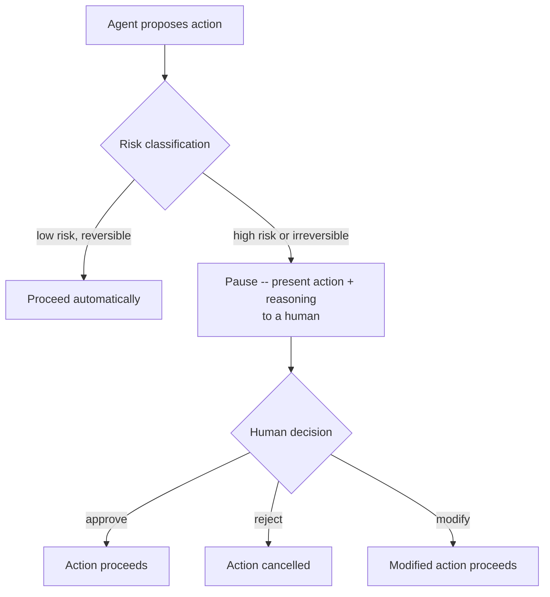

# Human-in-the-Loop

Sandboxing, policy enforcement, output validation, and audit trails are
all mechanisms an agent operates *within*. Human-in-the-loop (HITL) is
about deciding *when a human needs to be part of the loop directly* --
where an agent must stop and wait for a person to say "yes, proceed,"
rather than acting alone.

## What It Is

- **Human-in-the-loop**: a design pattern where specific points in an
  agent's workflow are designated as **checkpoints** -- the agent
  pauses, presents what it's about to do (and why), and waits for
  explicit human approval before continuing.
- This is distinct from a human just *reviewing logs afterward*
  ([audit/observability](audit-observability.md)) -- HITL is a
  *blocking* gate, before the consequential action happens, not a
  record read after it already did.
- **Override procedures**: the defined way a human can intervene mid-run
  -- approve, reject, modify the proposed action, or halt the agent
  entirely (a **kill switch**) -- and have that intervention actually
  take effect.
- Not every action needs a checkpoint -- the whole design problem is
  deciding *which* points in a workflow are worth the friction of a
  pause, and which are safe to fully automate.

## How It Works



### Deciding where checkpoints belong

A useful heuristic is to weigh each potential action along two axes:

- **Reversibility**: can this be undone cheaply if it's wrong? (A draft
  PR is reversible; a production database delete often isn't.)
- **Blast radius**: how much could go wrong, and how far could it
  spread, if this action is wrong? (See [sandboxing](sandboxing.md) for
  the related concept of containing blast radius technically, as
  opposed to gating it procedurally here.)

```
                     Low blast radius        High blast radius
Reversible           Automate freely         Automate, but log closely
Irreversible         Consider a checkpoint    Always require a checkpoint
```

- Actions that are both **irreversible and high blast radius**
  (deleting a production database, sending a mass email to all
  customers, merging a PR directly to `main` and deploying) are the
  clearest candidates for a mandatory human checkpoint.
- Actions that are **reversible and low blast radius** (opening a draft
  PR, writing to a scratch file, querying read-only data) are usually
  fine to fully automate -- adding a checkpoint there mostly adds
  friction without meaningfully reducing risk.
- The middle ground (e.g. reversible but high blast radius, like
  temporarily disabling a feature flag for all users) is a judgment
  call that depends on how quickly and confidently the action can be
  reversed if it's wrong.

## What Goes Wrong Without It

- A coding agent is given permission to open *and merge* PRs
  autonomously; it merges a change with a subtle logic error that
  passes CI (CI didn't cover that case) straight to production, with no
  point where a human would have caught the issue on read-through --
  merging is exactly the kind of irreversible, high-blast-radius step
  that argues for a checkpoint even when everything upstream looked
  fine.
- A support agent is authorized to issue refunds with no approval
  threshold; a manipulated or malfunctioning input causes it to issue a
  very large refund, and there was no point in the workflow where a
  human would have been asked to confirm an unusually large amount
  before it processed.
- A team adds a human-approval checkpoint on *every single action* an
  agent takes, including trivial, reversible ones -- humans become so
  fatigued rubber-stamping routine approvals that they stop reading
  what they're approving, and the checkpoint becomes theater rather
  than a real safeguard (this is as real a failure mode as having no
  checkpoints at all).
- An agent pauses for approval, but there's no real kill-switch/override
  path if the human says "no" mid-execution -- the agent has already
  committed to a multi-step action that can't cleanly be halted partway
  through, making the "approval" step meaningless in practice.

## Current Landscape (2026)

- **Agent orchestration frameworks with built-in approval steps** --
  several popular agent frameworks now ship first-class "pause for
  human approval" primitives as part of their workflow/graph
  definitions, rather than requiring teams to bolt this on separately.
- **Slack/Teams-integrated approval bots** -- a common lightweight
  pattern: an agent posts its proposed action to a channel with
  approve/reject buttons, making the checkpoint fit naturally into
  existing team communication tools rather than a separate dashboard.
- **Workflow/orchestration platforms** (e.g. general-purpose workflow
  engines used to sequence agent steps) increasingly offer native
  "wait for external signal" steps, which teams use specifically to
  implement HITL pauses within a larger automated pipeline.

## Why It Matters Long-Term

- This is the direct descendant of change-management practices in
  traditional operations -- deployment approvals, four-eyes principles
  on financial transactions, code review before merge. Those practices
  didn't disappear as tooling matured; they became more codified and
  automated in *where* they apply. HITL for agents is the same
  discipline, applied to a new class of actor.
- The goal over time isn't "keep humans in the loop everywhere forever"
  -- it's to get better at *precisely locating* the few points that
  genuinely warrant a pause, as trust and evidence (from evals, audit
  history, track record) accumulate for the routine, low-risk cases.
  That calibration work -- not a fixed checklist -- is the durable skill.
- As agents are trusted with increasingly consequential actions, the
  cost of getting checkpoint placement wrong rises on both sides: too
  few checkpoints risks real, hard-to-reverse harm; too many produces
  approval fatigue that erodes the safeguard's actual value. Getting
  this balance right is a permanent design skill, not a temporary
  scaffold to remove later.

## Quiz

1. What's the difference between human-in-the-loop and an audit trail,
   and why doesn't one substitute for the other?
   <details><summary>Show answer</summary>
   Human-in-the-loop is a *blocking* checkpoint before a consequential
   action happens -- the action doesn't proceed without approval. An
   audit trail is a record reviewed *after* an action has already
   occurred. An audit trail can't prevent a bad action, only help
   explain it afterward; HITL can prevent it in the first place, at the
   cost of added latency and friction on whatever it gates.
   </details>

2. Using the reversibility/blast-radius framework, would you put a
   mandatory checkpoint on an agent writing to a scratch/temp file
   versus an agent deleting a production database table? Why?
   <details><summary>Show answer</summary>
   Writing to a scratch file is reversible and low blast radius --
   automate it freely, a checkpoint would just add friction with little
   safety benefit. Deleting a production database table is irreversible
   (or extremely costly to reverse) and high blast radius -- this is
   exactly the case that calls for a mandatory human checkpoint before
   it executes.
   </details>

3. Why can adding a human-approval checkpoint to *every* action
   actually make a system less safe, not more?
   <details><summary>Show answer</summary>
   If humans are asked to approve a high volume of routine, low-risk
   actions, they experience approval fatigue and start rubber-stamping
   without really reading what they're approving -- so when a genuinely
   risky action does come through, it gets the same reflexive approval
   as everything else. A checkpoint only provides real safety if the
   human reviewing it is actually engaged, which requires reserving
   checkpoints for the cases that truly warrant the friction.
   </details>

4. A team implements an "approval" step for a multi-stage agent
   workflow, but discovers there's no way to actually stop the agent
   partway through if a human rejects the action. What's missing?
   <details><summary>Show answer</summary>
   A real override/kill-switch mechanism -- the workflow needs to be
   designed so a rejection at the checkpoint genuinely halts (or safely
   rolls back) further execution, not just logs a "rejected" status
   while the agent continues anyway. Without an enforceable stop
   mechanism, the approval step is cosmetic rather than a real control.
   </details>

5. Why is "add a checkpoint before every irreversible action" a
   reasonable starting heuristic, but not a complete answer on its
   own?
   <details><summary>Show answer</summary>
   It ignores blast radius and volume -- some irreversible actions are
   low-stakes and extremely frequent (e.g. sending a routine
   notification email can't be unsent, but is low-risk), and gating
   every one of those would create the approval-fatigue problem
   described above. A complete answer weighs both reversibility *and*
   blast radius, and also accounts for how much approval volume a human
   reviewer can meaningfully sustain.
   </details>
