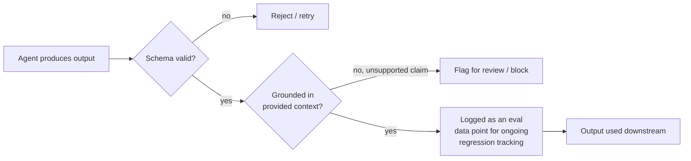

# Output Validation & Evals

Sandboxing contains where an action can happen, and policy enforcement
gates whether an action is allowed at all -- but neither of those checks
whether the agent's actual *output* (the code it wrote, the answer it
gave, the data it extracted) is correct, well-formed, or grounded in
reality. That's the job of output validation and evals.

## What It Is

- **Output validation**: checking an agent's output *before it's used*
  against structural and semantic expectations -- does it match the
  expected schema? Does it cite something that actually exists in the
  provided context? Is it internally consistent?
- **Structural/schema validation**: the mechanical check -- if the agent
  is supposed to return JSON matching a specific shape, does the output
  actually parse and conform to that shape? This catches malformed
  output before it crashes or silently corrupts a downstream system.
- **Hallucination detection**: checking whether the agent asserted
  something (a fact, a citation, an API that exists) that isn't
  actually true or isn't actually supported by its given context.
- **Contextual grounding**: verifying that claims in the output are
  traceable back to the source material the agent was given, rather
  than invented -- "grounded" means "backed by something real that was
  actually provided," not just "plausible-sounding."
- **Evals**: a broader, *ongoing* practice of systematically measuring
  an agent's output quality against a test suite of scenarios --
  crucially, not a one-time pre-launch test, but a continuously
  re-run regression suite, since prompts, models, and tool behavior all
  drift over time.

## How It Works

- Validation happens **inline**, per-output, blocking or flagging bad
  results before they propagate.
- Evals happen **continuously**, out-of-band -- a running scorecard of
  "how well is this agent doing right now, on a representative set of
  cases," re-evaluated every time the prompt, model version, or tools
  change, precisely because any of those can silently shift behavior.
- A mature setup treats every production interaction (or a sample of
  them) as potential future eval data: real failures get turned into
  regression test cases, so the eval suite grows to reflect real
  observed failure modes, not just the ones anticipated up front.

## What Goes Wrong Without It

- An agent that's supposed to return `{"status": "approved" |
  "rejected", "reason": string}` occasionally returns a stray sentence
  of prose instead of valid JSON, and a downstream system that assumed
  well-formed JSON crashes or -- worse -- silently defaults to a wrong
  state.
- A research assistant agent cites a paper, statistic, or API method
  that sounds authoritative but doesn't actually exist (a classic
  hallucination) -- and because nothing checked the citation against
  real, retrievable sources, a human downstream trusts and repeats it.
- A team ships a prompt change that improves the agent's tone but
  quietly regresses its accuracy on a category of questions it used to
  handle well -- and because there's no continuously re-run eval suite,
  nobody notices until customers start complaining.
- A coding agent generates a function that type-checks and looks
  reasonable, but subtly doesn't do what was asked (e.g. off-by-one
  logic) -- schema validation alone wouldn't catch this, since the
  *shape* of the output is fine; it takes a semantic/behavioral eval
  (does the generated code pass the actual test suite?) to catch it.

## Current Landscape (2026)

- **Guardrails AI** -- an open-source framework specifically for
  validating and correcting LLM outputs against defined structural and
  semantic rules (schemas, custom validators) before they're used
  downstream.
- **NeMo Guardrails** -- a toolkit (from NVIDIA) for defining
  programmable rails around what a model is allowed to say/do,
  including topic restrictions and grounding checks.
- **Eval platforms** (e.g. offerings from LangSmith, Braintrust, and
  similar LLM-ops platforms) -- built specifically for running
  continuous, regression-style eval suites against production agent
  behavior, tracking quality over time rather than as a one-off gate.

## Why It Matters Long-Term

- This is the direct evolution of automated testing (unit tests,
  integration tests, regression suites) applied to a fundamentally
  probabilistic component -- traditional software testing assumes
  deterministic outputs; agents don't give you that, so the discipline
  of "keep a representative test suite and re-run it continuously" has
  to adapt, not disappear.
- Models, prompts, and underlying tool behavior all change over time
  (model provider updates, prompt tweaks, new tool versions) -- a
  validation/eval practice that's continuous, not one-time, is what
  catches silent regressions before they reach users.
- As agents produce outputs that feed directly into consequential
  decisions (financial reports, medical information summaries, code
  that ships to production), the cost of an ungrounded or malformed
  output rises -- making this a permanent quality-assurance layer, not
  a "nice to have" while the technology is immature.

## Quiz

1. What's the difference between structural/schema validation and
   contextual grounding checks, and can an output pass one while
   failing the other?
   

Show answer

   Schema validation checks the *shape* of the output (valid JSON,
   correct fields, correct types); grounding checks whether the
   *content* is actually supported by the provided source material.
   Yes -- an output can be perfectly valid JSON with a well-formed
   `"citation"` field that nonetheless names a paper that doesn't exist,
   passing schema validation while failing grounding.
   

2. Why are evals described as an "ongoing practice" rather than a
   one-time test suite run before launch?
   

Show answer

   Because the underlying model, prompt, and tool behavior can all
   change after launch (model provider updates, prompt edits, new tool
   versions), any of which can silently shift the agent's quality up or
   down. A one-time pre-launch test only proves quality at that single
   snapshot in time -- continuous re-running is what catches a
   regression introduced by a later change, often before users notice.
   

3. A coding agent's generated function is syntactically valid, passes
   type checking, and matches the expected function signature -- but
   still doesn't do what was asked. What kind of check would catch
   this that schema validation wouldn't?
   

Show answer

   A behavioral/semantic eval -- e.g. actually running the generated
   code against a test suite or a set of example inputs/outputs and
   checking the results are correct. Schema validation only confirms
   the output has the right *shape* (valid syntax, right types); it
   says nothing about whether the logic inside actually satisfies the
   requirement.
   

4. Why would a team deliberately turn real production failures into
   new eval test cases, rather than just fixing the immediate bug and
   moving on?
   

Show answer

   Fixing the immediate bug addresses one instance, but adding it as a
   permanent eval case guards against *regressing* on that same failure
   mode later -- e.g. if a future prompt or model change accidentally
   reintroduces the same class of mistake, the eval suite catches it
   automatically instead of relying on the same failure recurring in
   production and being noticed again by chance.
   

5. Why can't hallucination detection be solved purely by asking the
   model "are you sure this is correct?"
   

Show answer

   A model's confidence in its own output isn't a reliable signal of
   correctness -- it can express high confidence in a fabricated fact
   just as fluently as in a true one, since both are generated by the
   same underlying process. Real hallucination detection needs an
   external check: verifying the claim against actual source material
   or a ground-truth reference, not asking the same model to
   self-assess.
   

