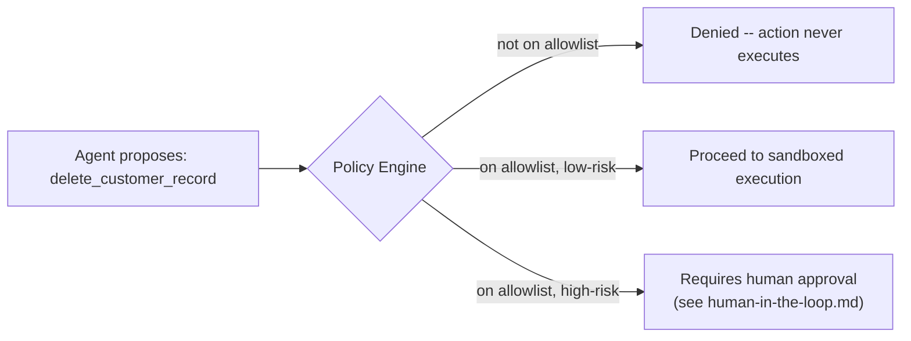

# Policy Enforcement

If [sandboxing](sandboxing.md) limits the damage *after* an agent acts,
policy enforcement decides *whether it should be allowed to act at
all*, before anything runs. It's the authorization layer sitting
between "the agent wants to do X" and "X actually happens."

## What It Is

- **Policy enforcement** is a rules layer that checks a proposed agent
  action against a set of allowed/disallowed rules -- *before* the
  action executes -- and blocks, allows, or requires approval for it
  accordingly.
- **Tool allowlisting**: an agent is only permitted to call a specific,
  enumerated set of tools/functions (e.g. "read files," "open a PR")
  rather than an open-ended "run arbitrary shell command." Anything not
  on the list is simply unavailable to the agent, not just discouraged.
- **Policy-as-code**: writing these authorization rules as versioned,
  testable code/configuration (rather than a wiki page or a prompt
  instruction), so they can be reviewed, tested, and enforced
  mechanically -- the same discipline that "infrastructure-as-code"
  brought to infrastructure changes.
- Crucially: policy enforcement is **pre-action** and should live
  *outside* the model's own judgment -- an instruction in a system
  prompt ("please don't delete production data") is a suggestion the
  model might ignore or be tricked out of; a policy engine that
  physically refuses the API call is an actual control.

## How It Works

- Every proposed tool call is intercepted and checked against policy
  *before* it reaches the real system -- the agent's own reasoning
  about whether an action is a good idea is never the sole gate.
- Policies typically express things like:
  - **Allowed tools**: which functions/APIs the agent may call at all.
  - **Scoped permissions**: e.g. "may read from the `orders` table, may
    not write to it" -- narrower than a blanket allow/deny per tool.
  - **Conditional rules**: "may open a PR, but may not merge it," or
    "may issue refunds up to $50 automatically, above that requires
    approval."
- This mirrors the **principle of least privilege** from traditional
  security: give the agent the minimum set of permissions it needs for
  its current task, not a broad grant "just in case."

## What Goes Wrong Without It

- An agent is told in its instructions "never modify files outside the
  `/scratch` directory" -- but that's a prompt-level suggestion, not an
  enforced boundary. A sufficiently unusual or adversarial input (or
  just an unlucky reasoning path) leads it to write outside that
  directory anyway, because nothing actually *stopped* the file-write
  call from succeeding.
- A support agent with a single broad "database access" tool (rather
  than narrowly scoped read/write permissions per table) ends up able
  to modify billing records when it was only ever supposed to look up
  order status.
- A coding agent with unrestricted `git push` access force-pushes over
  a colleague's branch, because "don't force-push to shared branches"
  lived only in a README, not in an enforced Git permission or
  pre-push hook.
- Two different teams each hand-configure their agent's allowed
  actions ad hoc, with no shared review process -- one team accidentally
  allows an agent to call a billing-refund endpoint with no cap, because
  nobody codified "refunds over $X require approval" as an actual,
  testable rule.

## Current Landscape (2026)

- **OPA (Open Policy Agent)** -- a general-purpose policy engine using
  the Rego language, widely used for infrastructure/Kubernetes policy
  and increasingly applied to gate agent tool calls before execution.
- **Cedar** -- an open-source policy language (created at AWS) designed
  for fine-grained, auditable authorization decisions, well suited to
  "can this agent perform this specific action on this specific
  resource" style questions.
- **Agent-framework-native guardrail layers** (e.g. permission/tool-scoping
  systems built into agent orchestration frameworks) -- increasingly,
  agent frameworks ship their own built-in allowlisting and
  scoped-permission primitives rather than requiring a fully separate
  policy engine, especially for simpler deployments.

## Why It Matters Long-Term

- This is the direct descendant of decades of access-control practice
  (RBAC, least privilege, IAM policies) applied to a new kind of actor:
  one that reasons in natural language and can be manipulated by its
  inputs in ways a traditional service account can't be. The underlying
  discipline -- decide permissions explicitly, enforce them outside the
  actor's own judgment, review them like code -- doesn't go away as
  models get better; if anything, it becomes more load-bearing as
  agents are trusted with more consequential actions.
- Prompt-level instructions will always be a soft, best-effort signal
  (models can misunderstand them, be jailbroken around them, or simply
  make mistakes) -- durable governance requires a hard boundary that
  doesn't rely on the model "choosing" to comply.
- As agents take on genuinely high-stakes actions (financial
  transactions, infrastructure changes, customer data access), policy
  enforcement is the layer that turns "we hope it behaves" into "it is
  structurally unable to do the disallowed thing."

## Quiz

1. Why isn't a system prompt instruction like "never delete files
   outside `/scratch`" sufficient governance on its own?
   

Show answer

   It's a suggestion interpreted by the model, not an enforced
   boundary -- the model can misunderstand it, be manipulated around it
   by unusual or adversarial inputs, or simply make a reasoning mistake
   that leads it to ignore the instruction. Real enforcement means the
   file-write call to a disallowed path fails or is blocked at the
   system level, regardless of what the model "intended."
   

2. What's the difference between tool allowlisting and scoped
   permissions within a single tool?
   

Show answer

   Tool allowlisting controls *which functions/APIs* the agent can call
   at all (e.g. it may call `read_file` but not `execute_shell`).
   Scoped permissions go a level deeper, restricting *what a given
   allowed tool can be used for* (e.g. `database_query` is allowed, but
   only against the `orders` table in read-only mode, not `billing` in
   write mode). Both are usually needed together -- allowlisting narrows
   the surface area, scoping narrows it further within each allowed
   tool.
   

3. Why is policy-as-code (versioned, testable rules) preferable to
   configuring permissions ad hoc per team or per agent?
   

Show answer

   Ad hoc configuration is invisible, unreviewed, and easy to get
   subtly wrong (as in the two-teams example) -- there's no shared
   record of what's allowed, no code review catching an overly broad
   grant, and no way to test "does this policy actually block what we
   think it blocks?" Policy-as-code makes the rules explicit,
   diffable, reviewable, and testable, the same benefits
   infrastructure-as-code brought to infrastructure changes.
   

4. An agent is allowed to "issue refunds." Why might you want a
   conditional rule (e.g. "auto-approve under $50, require approval
   above") instead of a flat allow or flat deny?
   

Show answer

   A flat deny defeats the point of automating routine, low-risk
   refunds; a flat allow exposes the business to unbounded financial
   risk from a single bad decision (or a manipulated/compromised
   agent). A conditional threshold captures the actual risk profile:
   small refunds are cheap mistakes to absorb and worth automating
   fully, while large refunds warrant a human check before money
   moves -- see [human-in-the-loop](human-in-the-loop.md) for how that
   checkpoint gets designed.
   

5. How does policy enforcement relate to the principle of least
   privilege?
   

Show answer

   Least privilege says an actor should have only the minimum access
   needed for its current task, not broad access "just in case."
   Policy enforcement is the mechanism that actually implements that
   principle for agents -- allowlisting and scoped permissions are how
   you express and enforce "minimum access needed" concretely, rather
   than leaving it as a vague security goal.
   

