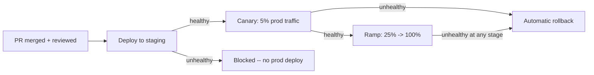

# Design an Agent That Can Deploy Code to Production

## Scenario

You're building an agent that monitors approved, merged PRs and
automatically deploys them to production -- running builds, running a
deployment pipeline, and monitoring the rollout. Design the governance
layer that makes autonomous production deployment safe.

## Guiding Questions

- Is "merged to `main`" sufficient signal to deploy, or does the deploy
  agent need its own independent checks?
- What does the agent do if a deployment starts looking unhealthy
  partway through (error rate spike, latency spike)?
- Should rollback be automatic, or does it also need a human decision?
- What's the difference in risk between deploying to a staging
  environment versus production, and should the agent's permissions
  differ between them?
- How do you make sure a bad deploy is caught quickly, rather than
  discovered by customers first?

## Your Write-Up

_Sketch your design here before revealing the reference approach._

```
(your notes)
```

## Reference Approach

<details>
<summary>Show reference approach</summary>

**Staged permissions, not a single "can deploy" flag**

- The agent has broad, low-friction permission to deploy to
  **staging/preview environments** automatically -- low blast radius
  (no real customers affected), fully reversible.
- Production deployment permission is scoped much more narrowly and
  requires passing every gate below -- deploying to production is
  treated as a fundamentally different, higher-risk action, not just
  "the same thing, later."

**Pre-deploy validation ([output validation](../output-validation-evals.md))**

- Before touching production, the agent confirms: the PR passed CI, was
  reviewed and approved by a human (the deploy agent checks for this
  explicitly -- it doesn't just trust that "merged" implies "reviewed"),
  and passed a staging deployment with its own health checks green for
  a minimum soak time.

**Progressive rollout with automatic containment ([sandboxing](../sandboxing.md)-style blast-radius limiting, applied to deployment)**

- Deploys go out via canary/progressive rollout (e.g. 5% of traffic →
  25% → 100%), not all at once -- this is the deployment-world
  equivalent of a sandbox: limiting how much of the real system is
  exposed to a bad change before it's confirmed safe.
- Automated health checks (error rate, latency, key business metrics)
  are monitored continuously during rollout, with pre-defined
  thresholds for "this looks unhealthy."



**Automatic rollback, not automatic-only forward progress**

- Rollback on detected unhealthiness is **automatic**, not gated on
  human approval -- the asymmetry matters: rolling back to a known-good
  previous state is the *safe* direction (reversible, restores a known
  state), so it doesn't need the same checkpoint that *rolling forward*
  into new, unproven code does. This is the key insight distinguishing
  this from a naive "always require human approval for deploys" design.
- A human is notified immediately when an automatic rollback occurs,
  but the rollback itself isn't blocked waiting for that notification
  to be acknowledged -- speed matters more than approval here, since
  the action taken is inherently the conservative one.

**Human-in-the-loop placement ([human-in-the-loop](../human-in-the-loop.md))**

- The *initial* production deploy decision (moving from "merged" to
  "deploying to real customers") requires the agent to have verified a
  human already approved the change via code review -- so the
  checkpoint here isn't a *new* human interaction, it's confirming an
  existing one actually happened, rather than trusting a merge event
  blindly.
- A genuinely novel, high-risk class of change (e.g. a schema
  migration, a change touching payment processing) is flagged for an
  *additional*, deploy-specific approval beyond the original code
  review -- recognizing that "reviewed for correctness" and "reviewed
  as safe to deploy right now" aren't always the same review.

**Audit trail**

- Every deploy decision (staging result, canary health metrics at each
  stage, rollback triggers and their specific metric thresholds) is
  logged durably, so a post-incident review can reconstruct exactly
  what the automated system saw and did, independent of asking anyone
  to remember it.

</details>
