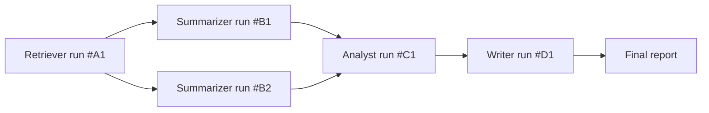

# Design the Audit Trail for a Multi-Agent Research Pipeline

## Scenario

A pipeline of several specialized agents works together to produce a
research report: a **retriever** agent gathers source documents, a
**summarizer** agent condenses them, an **analyst** agent draws
conclusions, and a **writer** agent produces the final report. Design
the audit trail that lets you answer, for any final report, "why does
it say this, and which agent is responsible if it's wrong?"

## Guiding Questions

- If the final report contains a wrong or unsupported claim, what would
  you need to have logged to figure out which agent introduced it?
- Should each agent's input/output be logged independently, or is a
  single end-to-end trace enough?
- How do you trace a specific sentence in the final report back to the
  original source document it's supposedly grounded in?
- What happens to the audit trail if one agent in the pipeline is
  retried after a failure -- do you keep the failed attempt's data too?
- Who consumes this audit trail -- engineers debugging, or also
  non-engineers checking the report's credibility?

## Your Write-Up

_Sketch your design here before revealing the reference approach._

```
(your notes)
```

## Reference Approach

<details>
<summary>Show reference approach</summary>

**Per-agent, linked traces ([audit/observability](../audit-observability.md))**

- Each agent's run gets its own trace record: input received, tool
  calls made, output produced, model/prompt version used, timestamp.
- Critically, each trace is linked to the specific upstream trace(s) it
  consumed -- the summarizer's trace references exactly which
  retriever outputs (with their own IDs) it was given, the analyst's
  trace references exactly which summaries it used, and so on. This
  creates a traceable **lineage graph**, not just an isolated list of
  logs.



**Claim-level grounding, not just stage-level logging**

- The writer agent is required (via [output
  validation](../output-validation-evals.md)) to attach a source
  reference to each substantive claim in the final report -- pointing
  back to the specific analyst conclusion, which itself points back to
  specific summarizer output, which points back to a specific source
  document. This lets you trace a single sentence in the final report
  all the way back to original source material, not just "the writer
  agent ran at 3pm."
- If a claim can't be traced to a concrete upstream reference, that's
  itself flagged as a potential hallucination before the report is
  finalized.

**Retries and failed attempts**

- Failed or retried agent runs are kept in the trace store, not
  discarded -- marked with a status (`failed`, `retried`,
  `superseded`) rather than deleted. A wrong final answer might trace
  back to a *retry* that "succeeded" on a bad output the first attempt
  had correctly rejected, and that's only diagnosable if the failed
  attempt's data still exists.

**Two audiences, two views**

- **Engineering view**: full trace detail -- raw tool calls, arguments,
  model parameters, latencies -- for debugging behavior.
- **Credibility view**: a simplified, human-readable rendering of the
  lineage graph attached to the report itself (e.g. "this conclusion is
  based on these 3 sources, summarized by run #B1 and #B2") -- so a
  non-engineer reader (an editor, a stakeholder, an auditor) can
  sanity-check the report's grounding without needing access to the
  full engineering trace store.

**Storage**

- Traces stored durably and separately from the pipeline's working
  state (so a bug in one agent can't corrupt the record of what
  happened), indexed both by pipeline run and by individual agent/stage,
  so you can query "show me everything that fed into this report" or
  "show me every report this specific retriever run contributed to" (useful
  if a bad source document is later found to have poisoned multiple
  reports).

</details>
