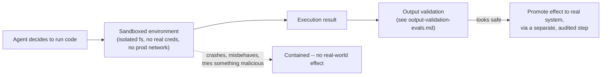

# Sandboxing

Sandboxing is the runtime containment layer: when an agent executes
code or takes an action, sandboxing limits *where the damage can reach*
if that action turns out to be wrong, malicious, or just buggy.

## What It Is

- A **sandbox** is an isolated execution environment -- a container, VM,
  or restricted process -- where code runs with a deliberately limited
  view of the world: limited filesystem access, limited network access,
  limited (or no) credentials to real systems.
- The goal isn't to prevent all mistakes -- it's to guarantee that *when*
  a mistake happens, it's contained to a small, recoverable, disposable
  space instead of touching production data, real customers, or real
  money.
- **Blast radius** is the term for "how much can go wrong from one bad
  action." Sandboxing is fundamentally a blast-radius-limiting tool.

## How It Works

Key mechanisms that make a sandbox actually a sandbox, not just "a
different folder":

- **Filesystem isolation**: the agent can only read/write within a
  scoped, disposable directory or container filesystem -- never the
  host's real filesystem.
- **Network isolation**: no route to production databases, internal
  APIs, or the public internet unless explicitly allowlisted (see
  [policy enforcement](policy-enforcement.md) for *how* that allowlist
  is decided).
- **Credential scoping**: the sandbox holds no real API keys/secrets by
  default -- if it needs to call an external service, it gets a
  narrowly-scoped, short-lived, sandboxed credential (e.g. a test API
  key, not the production one).
- **Resource limits**: CPU, memory, and execution time caps, so a
  runaway loop or fork bomb can't take down the host or rack up an
  unbounded cloud bill.
- **Ephemerality**: sandboxes are typically thrown away after use
  (or after a short TTL) rather than persisted and reused -- so state
  from one run can't leak into the next.

## What Goes Wrong Without It

- An agent asked to "clean up temp files" runs `rm -rf` against a path
  it mis-resolved, and because it was executing with the same
  filesystem access as a real deployment process, it deletes production
  data -- not a hypothetical, this is a documented failure mode with
  early coding agents given unrestricted shell access.
- An agent debugging a script accidentally exfiltrates a secret it
  found in an environment variable, because its process had network
  access and the same credentials as the service it was "just reading
  code for."
- A coding agent given full write access to a real GitHub repo (rather
  than a scratch branch/fork in an isolated CI runner) pushes a broken
  commit directly to `main`, with no intermediate contained step where
  the change could be reviewed before it touched the real branch.
- Without resource limits, an agent stuck in a retry loop against a
  paid API can generate a very large, very real bill before anyone
  notices -- the sandbox's resource caps are what would have stopped it
  automatically.

## Current Landscape (2026)

- **E2B** -- a managed platform purpose-built for spinning up short-lived,
  isolated sandboxes (VMs/containers) specifically for running
  AI-agent-generated code, with filesystem and network isolation
  built in.
- **OpenSandbox** -- an open-source sandboxing runtime aimed at agentic
  code execution, giving teams a self-hostable alternative to managed
  sandbox providers.
- **Firecracker microVMs** (the underlying technology behind several
  serverless and agent-sandbox platforms) -- lightweight VMs that boot
  in milliseconds, giving near-container speed with much stronger
  isolation guarantees than a plain container.
- Beyond dedicated products: many teams still build sandboxing
  themselves out of ordinary containers (Docker) with strict
  `--network none`, read-only filesystem mounts, and seccomp/AppArmor
  profiles -- valid, but easy to under-scope if done ad hoc.

## Why It Matters Long-Term

- Sandboxing isn't a stopgap until agents get "good enough" to be
  trusted with raw access -- it's the same reasoning that keeps
  container isolation, VM isolation, and process sandboxing (browser
  tabs, mobile app sandboxes) permanent fixtures of computing, long
  after each of those runtimes matured. Containment is valuable
  *regardless* of how capable the thing inside the container is.
  Even a perfectly reliable agent should run in a sandbox, the same
  way a trusted human engineer still doesn't get to `sudo` into
  production from their laptop on a whim.
- As agents get *more* capable and are given *more* autonomy (more
  steps between human checks), the value of hard containment goes up,
  not down -- there are more opportunities for a subtly wrong decision
  to compound before anyone notices.
- This is the direct analog of why sandboxing/VMs/containers became
  permanent, load-bearing infrastructure in traditional software --
  agentic systems are simply the newest thing that needs a contained
  place to run.

## Quiz

1. Why is "the agent runs in a separate folder" not the same thing as
   real sandboxing?
   

Show answer

   A separate folder alone doesn't restrict network access, doesn't
   limit which credentials the process can use, and doesn't cap
   resource usage -- an agent process in "just a different folder" can
   still reach the network, read environment variables containing real
   secrets, and consume unbounded CPU/memory. Real sandboxing requires
   isolating all of those dimensions (filesystem, network, credentials,
   resources), not just the working directory.
   

2. An agent needs to call a real payment API to test a checkout flow.
   What's the sandboxed way to do this, rather than just giving it the
   production API key?
   

Show answer

   Give it a scoped, non-production credential -- e.g. the payment
   provider's test-mode API key, which processes fake transactions
   against a sandboxed version of the payment system. If a real
   production call is genuinely required, it should go through a
   separate, explicitly audited and rate-limited path, not the agent's
   general-purpose sandbox credentials.
   

3. Why does ephemerality (throwing away the sandbox after each run)
   matter, beyond just "cleanliness"?
   

Show answer

   A persistent sandbox can accumulate state across runs -- a leftover
   file, a stale cached credential, a partially-completed malicious
   action from a previous run -- that then influences or compromises a
   later, seemingly unrelated run. Ephemeral sandboxes guarantee every
   execution starts from a known-clean state, which also makes
   reasoning about and auditing any single run's effects much simpler.
   

4. A team argues "our agent has never made a destructive mistake in
   six months, so we can relax the sandbox and give it real
   filesystem access." What's the flaw in that reasoning?
   

Show answer

   Six months without an incident isn't evidence the agent (or the
   underlying model) can't make a destructive mistake -- it's evidence
   that it hasn't yet, which isn't the same thing, especially as
   inputs, prompts, and edge cases change over time. Sandboxing is
   insurance against the *tail risk* of a rare but severe mistake, not
   a training-wheels measure to remove once things "seem fine" --
   the same way a payments company doesn't remove double-entry
   bookkeeping controls just because they haven't caught a discrepancy
   recently.
   

5. What's the relationship between sandboxing and blast radius?
   

Show answer

   Blast radius describes the scope of harm a bad action could cause;
   sandboxing is one of the primary tools for actively shrinking that
   scope, by ensuring the agent's actions can only affect an isolated,
   disposable environment rather than real systems, data, or users --
   turning a potentially catastrophic mistake into a contained,
   recoverable one.
   

