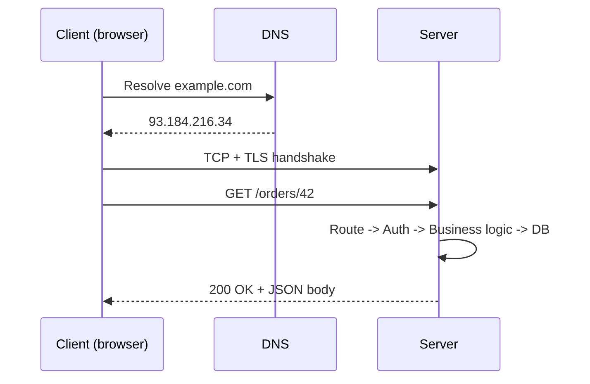

# 1. Client-Server Basics & the Request Lifecycle

Everything else in system design is a variation on "a client asks a
server for something, and the server answers." Get this loop solid
first -- it's the unit every later topic (load balancing, caching,
databases) attaches itself to.

## What It Is

- **Client**: anything that initiates a request -- a browser, a mobile
  app, another server acting on someone else's behalf.
- **Server**: a process listening on a port, waiting to handle requests
  and send back responses.
- **Protocol**: the agreed-upon format for the conversation. On the web,
  that's almost always HTTP(S) riding on top of TCP.
- The relationship is fundamentally **request/response**: the client
  doesn't get data until it asks, and the server doesn't act until asked
  (contrast this with the pub/sub model in [message queues](06-message-queues.md),
  where servers push data without being asked each time).

## Analogy

> A restaurant. You (the client) tell the waiter (the request) what you
> want. The kitchen (the server) prepares it and the waiter brings it
> back (the response). You don't walk into the kitchen yourself, and the
> kitchen doesn't start cooking until an order comes in. The menu is the
> API -- the fixed set of things you're allowed to ask for.

## How It Works

A single request roughly goes through these stages:

1. **DNS lookup** -- translate `example.com` into an IP address.
2. **TCP handshake** -- client and server agree to open a connection
   (SYN, SYN-ACK, ACK).
3. **TLS handshake** (if HTTPS) -- negotiate encryption keys.
4. **Request sent** -- client sends an HTTP request: method, path,
   headers, optional body.
5. **Server processing** -- routing, auth, business logic, maybe a
   database call.
6. **Response sent** -- status code, headers, body.
7. **Connection reused or closed** -- modern HTTP keeps the TCP
   connection alive for further requests (avoids repeating steps 1-3).

Key vocabulary that shows up constantly:

- **Latency**: time for one request to get a response (milliseconds).
- **Throughput**: how many requests a system handles per second.
- **Statelessness**: the server doesn't remember anything about you
  between requests -- each request carries all the context it needs
  (e.g. an auth token). This is what makes [horizontal scaling](10-scalability-patterns.md)
  easy: any server can handle any request.
- **Idempotency**: making the same request twice has the same effect as
  making it once (important for retries after a dropped connection).

## Why It Matters

- Every interview question starts here: "the client sends X" is always
  step one of a design, so being fluent in the request lifecycle means
  you don't fumble the easy part and can spend your time on the
  interesting tradeoffs.
- Knowing *where* time is spent (DNS, handshake, server processing,
  network transfer) tells you *where* to optimize -- caching attacks
  different stages than load balancing does.
- Statelessness is the single biggest design decision that determines
  whether a system can scale horizontally without pain.

## Quiz

1. Why does reusing a TCP connection (keep-alive) make subsequent
   requests faster?
   

Show answer

   Because the TCP handshake (and TLS handshake, if HTTPS) only has to
   happen once per connection instead of once per request. Skipping
   those round trips removes real, measurable latency, especially over
   high-latency networks.
   

2. A server stores your shopping cart in its own local memory, keyed by
   your session ID. What problem does this cause once you add a second
   server behind a load balancer?
   

Show answer

   Your next request might land on the second server, which has never
   seen your cart -- it doesn't exist there. This is the classic
   symptom of a stateful server; the fix is to move that state
   somewhere all servers can reach (a shared cache or database), making
   the servers themselves stateless.
   

3. What's the difference between latency and throughput, and can you
   improve one while making the other worse?
   

Show answer

   Latency is the time for a single request to complete; throughput is
   how many requests the system processes per unit time. Yes -- e.g.
   batching multiple requests together can raise throughput (more
   total work done per second) while increasing the latency of any
   individual request (it has to wait for the batch to fill).
   

4. Why is idempotency important for handling network retries?
   

Show answer

   If a client doesn't get a response (timeout, dropped connection), it
   often doesn't know whether the server actually processed the
   request. If the operation is idempotent (e.g. "set balance to $50"),
   safely retrying is trivial. If it's not (e.g. "add $50 to balance"),
   a retry can double-apply the effect -- so non-idempotent operations
   need extra machinery like idempotency keys.
   

5. Where would you look first if a single API endpoint suddenly had
   10x higher latency than usual?
   

Show answer

   Work through the lifecycle stages: DNS (unlikely to change
   suddenly), network/handshake (check for infra issues), then server
   processing -- this is the most common culprit, often a slow
   downstream dependency like a database query that stopped using an
   index, or a newly saturated resource (CPU, connection pool).
   

