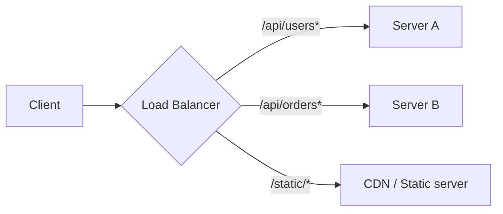

# 2. Load Balancing

Once one server isn't enough, you need something in front of many
servers deciding which one handles each request. That's a load
balancer (LB).

## What It Is

- A load balancer sits between clients and a pool of backend servers,
  distributing incoming requests across them.
- Goals: no single server gets overwhelmed, failed servers get skipped,
  and (ideally) clients never notice there's more than one server back
  there.
- Load balancers can be hardware appliances, but in practice today
  they're almost always software (nginx, HAProxy, Envoy) or a managed
  cloud service (AWS ELB/ALB, GCP Load Balancer).

## Analogy

> The host stand at a busy restaurant. Multiple tables (servers) are
> available; the host (load balancer) decides which table each new
> party (request) goes to -- maybe round-robin, maybe whichever table
> has been empty longest, maybe skipping a table that's currently a
> mess (unhealthy) until it's cleaned up (passes a health check).

## How It Works

### L4 vs L7 load balancing

- **L4 (transport layer)**: routes based on IP address and port only --
  it doesn't look inside the packet's payload. Fast, protocol-agnostic,
  but "dumb": it can't route `/api/users` differently from
  `/api/orders`.
- **L7 (application layer)**: understands the actual protocol (HTTP),
  so it can route on URL path, headers, cookies, even request body.
  Slower per-request (more to parse) but far more flexible.

### Common algorithms

| Algorithm | How it picks | Good for |
|---|---|---|
| Round robin | Cycles through servers in order | Uniform, stateless requests |
| Weighted round robin | Round robin, but bigger servers get more turns | Mixed server sizes |
| Least connections | Sends to the server with fewest active connections | Long-lived / uneven requests |
| IP hash | Hashes client IP to consistently pick the same server | "Sticky" sessions without shared state |
| Random | Picks at random (surprisingly competitive at scale) | Simplicity, large pools |

### Health checks

- The LB periodically pings each server (e.g. `GET /health`).
- A server that fails checks gets pulled out of rotation until it
  recovers -- this is what makes a fleet resilient to individual server
  crashes.

### Where load balancers live

- Usually more than one layer: a global LB (DNS-based, routes to the
  nearest region) → a regional L7 LB (routes by path to service
  clusters) → sometimes an internal LB between microservices.

## Why It Matters

- Load balancing is the mechanism that turns "one server" into "a
  fleet," which is the prerequisite for both scalability and
  availability (see [scalability patterns](10-scalability-patterns.md)).
- L4 vs L7 is a very common interview trip-up: know that L7 costs more
  CPU per request but buys you smart routing, A/B testing, and
  path-based rules.
- Health checks are what make horizontal scaling actually safe --
  without them, a crashed server still receives traffic and every
  request to it fails.

## Quiz

1. Why can't an L4 load balancer route `/api/v1/*` to one set of
   servers and `/api/v2/*` to another?
   

Show answer

   L4 only sees IP/port information (the transport layer) -- it never
   looks at the HTTP request line or headers, so it has no idea what
   path was requested. Path-based routing requires understanding the
   HTTP protocol, which is an L7 (application layer) capability.
   

2. You have three backend servers: two small, one large (2x the
   capacity). Which load-balancing algorithm fits, and why not plain
   round robin?
   

Show answer

   Weighted round robin, giving the large server roughly double the
   share of requests. Plain round robin sends each server an equal
   share regardless of capacity, so the two small servers would get
   overloaded while the large one is under-utilized.
   

3. What does a failed health check actually do to traffic routing?
   

Show answer

   The load balancer temporarily removes that server from the pool of
   eligible targets, so no new requests are routed to it until it
   starts passing health checks again. In-flight requests to it may
   still fail or time out, but no new ones are sent its way.
   

4. Why might "least connections" be a better choice than round robin
   for a service with highly variable request durations (e.g. some
   requests take 10ms, others take 10s)?
   

Show answer

   Round robin assumes every request is roughly equal work, so it can
   accidentally pile several slow, long-running requests onto one
   server while others sit idle. Least connections actively accounts
   for current load, routing new requests to whichever server has the
   fewest requests in flight right now.
   

5. If you need a client's requests to consistently land on the same
   backend server (e.g. because that server holds an in-memory
   session), which algorithm helps, and what's the downside?
   

Show answer

   IP hash (or a cookie-based equivalent) gives you "sticky sessions."
   The downside: it undermines even load distribution (some hashes
   cluster onto fewer servers) and makes it painful to remove or add
   servers, since the hash-to-server mapping shifts. This is also a
   sign the architecture leans stateful -- often better solved by
   moving session state out of the server entirely (see
   [caching](03-caching.md)).
   

