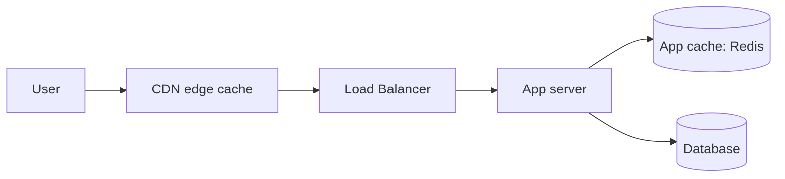

# 3. Caching

Caching is "remember the answer so you don't have to redo the work."
It's the single highest-leverage technique for making systems faster
and cheaper, and it shows up at nearly every layer of a system.

## What It Is

- A cache stores a copy of data that's expensive to compute or fetch,
  keyed so it can be looked up quickly later.
- The core tradeoff is always **speed vs freshness**: cached data is
  fast to read but might be stale.
- Caches exist at multiple layers, each solving a different bottleneck:
  - **Client-side**: browser cache, mobile app cache.
  - **CDN**: caches static (and sometimes dynamic) content at edge
    locations close to users, geographically.
  - **Application-level**: an in-memory or Redis/Memcached cache in
    front of a database, inside your service.
  - **Database-level**: query result caches, buffer pools that keep hot
    pages of data in memory.

## Analogy

> Keeping a printed cheat sheet on your desk instead of looking up the
> answer in a giant reference book every time. It's much faster to
> glance at the cheat sheet -- but if the reference book gets updated
> and you forget to update your cheat sheet, you're now confidently
> wrong. That's the entire cache invalidation problem in one sentence.

## How It Works

### Where a cache sits

A request tries the fastest layer first and falls back:
CDN → app cache → database. Each miss is more expensive than the last.

### Cache read patterns

- **Cache-aside (lazy loading)**: app checks cache first; on a miss, it
  reads from the DB, then writes the result into the cache for next
  time. Most common pattern -- simple, and only caches what's actually
  requested.
- **Write-through**: every write goes to the cache and the DB
  together, synchronously. Cache is always fresh, but writes are
  slower.
- **Write-behind (write-back)**: writes go to the cache immediately and
  are flushed to the DB asynchronously later. Fast writes, but risk of
  data loss if the cache dies before flushing.

### Eviction policies

When the cache is full, something has to go:

| Policy | Rule | Good for |
|---|---|---|
| LRU (Least Recently Used) | Evict the item not accessed in the longest time | General purpose, most common default |
| LFU (Least Frequently Used) | Evict the item accessed the fewest times | Stable "hot set" access patterns |
| TTL (Time To Live) | Evict after a fixed expiry, regardless of use | Data with a natural freshness window |

### Cache invalidation

The classic hard problem ("there are only two hard things in computer
science: cache invalidation and naming things"). Strategies:

- **TTL expiry**: simplest -- accept some staleness, bounded by a timer.
- **Write-through invalidation**: update/delete the cache entry the
  moment the underlying data changes.
- **Event-driven invalidation**: the data-owning service publishes a
  "this changed" event (see [message queues](06-message-queues.md)),
  and caches subscribe and evict accordingly.

## Why It Matters

- Caching is usually the cheapest way to buy a 10-100x latency
  improvement -- cheaper than scaling out more database replicas.
- Nearly every "design X at scale" interview question has a moment
  where the interviewer wants to hear "we'd cache Y here, with Z
  eviction/invalidation strategy" -- it signals you know where the
  actual bottleneck would be.
- Picking the wrong invalidation strategy is a real production
  footgun: stale cached prices, stale permissions, stale inventory
  counts are all classic "cache invalidation" incidents.

## Quiz

1. In cache-aside, what happens on the very first request for a piece
   of data, and why is that request slower than subsequent ones?
   

Show answer

   It's a cache miss: the app checks the cache, finds nothing, reads
   from the database, then writes the result into the cache. That
   first request pays the full database round trip plus a cache write;
   every request after it (until eviction/expiry) is served straight
   from the cache.
   

2. Why is write-behind risky, and when might the risk be acceptable?
   

Show answer

   Because the write is acknowledged as soon as it hits the cache, but
   the source-of-truth database update happens later, asynchronously --
   if the cache crashes before flushing, that write is lost. It's
   acceptable for data where perfect durability isn't critical (e.g.
   view counters, analytics events) but risky for anything like
   financial transactions.
   

3. Your product page shows a price that's cached with a 10-minute TTL.
   Marketing needs a flash sale price to go live instantly. What's
   wrong with just waiting for the TTL, and what would you do instead?
   

Show answer

   Waiting for the TTL means up to 10 minutes of customers seeing the
   wrong price -- unacceptable for a time-sensitive sale. Instead, use
   active invalidation: when the price changes, explicitly delete or
   update that cache key (write-through invalidation), rather than
   relying on passive expiry.
   

4. What's the difference between LRU and LFU, and can you construct an
   access pattern where LRU performs worse?
   

Show answer

   LRU evicts based on recency (how long ago something was used); LFU
   evicts based on frequency (how often). LRU does worse when there's a
   "one-off scan" -- e.g. a batch job that reads thousands of records
   once each -- because that scan can flush out genuinely hot, frequently
   used items just because they weren't the *most recent* accesses,
   even though LFU would have correctly kept them (they're accessed far
   more often overall).
   

5. A CDN caches your homepage HTML for anonymous visitors but must
   never cache a logged-in user's personalized dashboard. How would
   you design that distinction?
   

Show answer

   Key the caching decision on something the CDN can see without
   understanding your app logic -- typically: cache only responses
   without a session cookie/auth header present in the request, and set
   `Cache-Control: private` or `no-store` on personalized responses so
   the CDN knows not to cache them, while public pages get
   `Cache-Control: public, max-age=...`.
   

