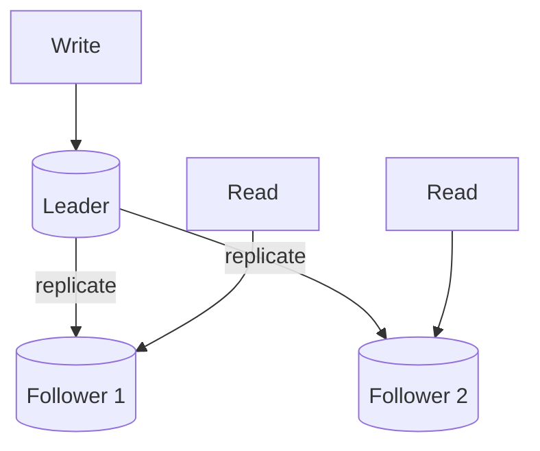
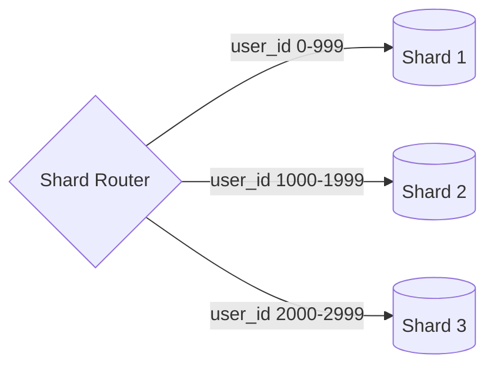

# 4. Databases: SQL vs NoSQL, Indexing, Replication, Sharding

Almost every system design question eventually asks "where does the
data live, and how does it survive one server dying or one table
getting too big to fit anywhere." This file covers the four building
blocks: the SQL/NoSQL choice, indexing, replication, and sharding.

## What It Is

- **Database**: a system that durably stores data and lets you query
  it, ideally faster than "read every row and check."
- **SQL (relational)**: data lives in tables with fixed schemas and
  relationships enforced between them (foreign keys). Query language:
  SQL. Examples: Postgres, MySQL.
- **NoSQL**: an umbrella term for "not a traditional relational
  database" -- covers several different data models:
  - **Key-value** (Redis, DynamoDB): get/set by key, no query language.
  - **Document** (MongoDB): JSON-like documents, flexible schema.
  - **Wide-column** (Cassandra, HBase): rows can have different columns,
    optimized for huge write volume.
  - **Graph** (Neo4j): nodes and edges, optimized for relationship
    traversal.

## Analogy

> SQL is a library with a strict card catalog: every book *must* be
> categorized by author, title, and subject, and the catalog enforces
> that consistently -- great for complex cross-referencing ("all
> mystery novels published after 1990 by authors born in Chicago"), but
> slow to reshelve if you change the categorization scheme.
>
> NoSQL is more like sticky notes on a corkboard: each note can have
> whatever fields it wants, and you don't get complex cross-referencing
> for free -- but adding a new note, or a million new notes, is trivial
> and fast.

## How It Works

### SQL vs NoSQL: how to actually choose

| Signal | Leans SQL | Leans NoSQL |
|---|---|---|
| Data shape | Structured, relationships matter (orders → line items → products) | Flexible/evolving schema, self-contained documents |
| Query needs | Complex joins, aggregations, transactions | Simple lookups by key, or specialized access pattern |
| Consistency need | Strong consistency, ACID transactions | Often fine with [eventual consistency](05-consistency-models.md) |
| Scale pattern | Vertical first, harder to shard | Built for horizontal scale from day one |

In practice, most real systems use **both**: a relational database for
the core transactional data (orders, payments, users) and one or more
NoSQL stores for specific access patterns (a key-value cache, a search
index, a document store for flexible content).

### Indexing

- An index is a separate data structure (usually a B-tree) that maps a
  column's values to the rows that have them, so the database doesn't
  have to scan every row (a "full table scan") to find a match.
- Cost: every index speeds up reads on that column but slows down
  writes (the index has to be updated too) and takes extra storage.
- Rule of thumb: index columns you filter (`WHERE`) or sort (`ORDER BY`)
  on frequently; don't over-index write-heavy tables.

```
Without an index:  scan all 10M rows to find WHERE user_id = 42
With an index:      B-tree lookup -> jump straight to the matching rows
```

### Replication

- Copying data across multiple database servers so a single server
  failure doesn't lose data or take down reads.
- **Leader-follower (primary-replica)**: one server accepts writes (the
  leader); it streams changes to one or more followers, which serve
  reads. Most common setup.
- **Multi-leader**: more than one server accepts writes, then they sync
  with each other -- more availability, but now you have to resolve
  conflicting writes.



- **Synchronous replication**: leader waits for followers to confirm
  before acknowledging the write. Safer, slower.
- **Asynchronous replication**: leader acknowledges immediately, sends
  to followers in the background. Faster, but a leader crash can lose
  the most recent writes that hadn't replicated yet.

### Sharding (partitioning)

- Splitting one huge dataset across multiple database servers, where
  *each shard holds a different subset of the data* (unlike
  replication, where each replica holds the *same* data).
- Common sharding keys: by user ID range, by hash of a key, or by
  geography.
- The hard part: picking a shard key that spreads load evenly and
  keeps together the data you usually query together (cross-shard
  joins are expensive or impossible).



## Why It Matters

- "SQL vs NoSQL" is often the very first fork in a system design
  interview -- justify it by the access pattern and consistency needs,
  not by familiarity or trend.
- Replication is what makes a database survive a server dying;
  sharding is what makes a database survive *too much data or
  traffic* for one server to handle at all. They solve different
  problems and are usually both present in a large system.
- A well-chosen index can be the difference between a query taking 2ms
  and 20 seconds -- and interviewers love asking "how would you speed
  up this query?"

## Quiz

1. You're designing a product catalog where item attributes vary
   wildly by category (a book has an ISBN, a shirt has a size). Would
   you lean SQL or NoSQL, and why?
   <details><summary>Show answer</summary>
   Leans NoSQL (document store) -- the flexible, per-item schema is
   exactly what document databases are built for, and you likely don't
   need complex cross-table joins for individual catalog lookups. If
   you also need strong relational guarantees elsewhere (orders,
   payments), that part of the system can still be SQL -- it's not
   all-or-nothing.
   </details>

2. Why does adding an index speed up reads but slow down writes?
   <details><summary>Show answer</summary>
   The index is an extra data structure that must stay in sync with the
   table. A read can use it to jump straight to matching rows instead
   of scanning everything. But every write (insert/update/delete) now
   has to also update that index structure, which is additional work
   on top of writing the row itself.
   </details>

3. In leader-follower replication with asynchronous replication, what's
   the risk if the leader crashes right after acknowledging a write?
   <details><summary>Show answer</summary>
   That write might not have reached any follower yet, since
   acknowledgment happens before replication completes. If the leader
   is gone and a follower gets promoted to the new leader, that most
   recent write can be permanently lost -- a real durability/consistency
   tradeoff made in exchange for lower write latency.
   </details>

4. What's the key difference between replication and sharding?
   <details><summary>Show answer</summary>
   Replication makes copies of the *same* data across multiple servers
   (for availability and read scaling). Sharding splits *different*
   data across multiple servers (for handling more total data/traffic
   than one server could hold). They're complementary: a large system
   often shards its data, and then replicates each shard.
   </details>

5. You shard a social network's data by `user_id`. What query becomes
   expensive or awkward as a result, and why?
   <details><summary>Show answer</summary>
   Queries that need data from multiple users at once that don't share
   a shard -- e.g. "show me my friends' recent posts" -- because your
   friends' data likely lives on different shards than yours. You end
   up fanning the query out to multiple shards and merging results in
   the application layer, which is slower and more complex than a
   single-shard query.
   </details>
