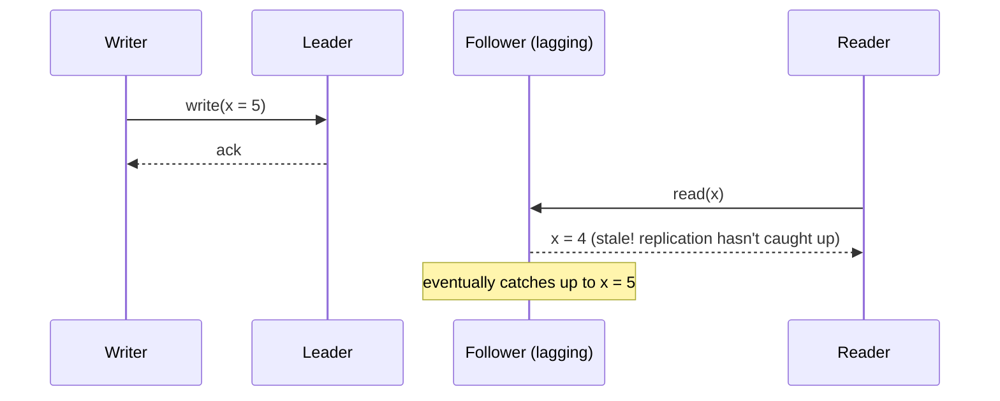

# 5. Consistency Models: CAP Theorem, Strong vs Eventual Consistency

Once data lives on more than one machine (replication, sharding), you
run into an unavoidable question: if two copies disagree, even for a
moment, what do you promise the caller? This file is about naming and
reasoning about that tradeoff.

## What It Is

- **Consistency** (in this context): whether every read sees the most
  recent write, or might see something older.
- **CAP theorem**: in a distributed system, when a **network partition**
  happens (some servers can't talk to others), you must choose between:
  - **C**onsistency -- every node returns the most recent write, or an
    error if it can't guarantee that.
  - **A**vailability -- every request gets a (non-error) response, even
    if it might not be the latest data.
  - You can't have both *during a partition*. **P**artition tolerance
    isn't really optional in real distributed systems (networks do
    fail), so in practice CAP is really "choose C or A when a partition
    happens."

## Analogy

> Two people editing the same shared document, but they're on a plane
> with spotty wifi (a partition). Strong consistency: the document
> editor blocks you from typing until it confirms both copies agree --
> you might not be able to save at all right now (favors correctness
> over availability). Eventual consistency: it lets you keep typing
> locally and syncs up later when the wifi returns -- you can always
> work, but for a while the two copies of the document might disagree.

## How It Works

### The consistency spectrum

It's not binary -- there's a spectrum between "always agree" and
"agree eventually":

| Model | Guarantee | Example use |
|---|---|---|
| Strong consistency | Every read sees the latest write, everywhere, immediately | Bank balance, inventory count |
| Read-your-writes | You always see your own recent writes (others might lag) | Editing your own profile |
| Eventual consistency | All replicas *converge* to the same value, given enough time with no new writes | Social media like counts, DNS records |

### CAP in practice

- CAP is often mis-stated as "pick 2 of 3" -- more accurately: network
  partitions *will* happen, so the real choice is what your system does
  *during* one:
  - **CP** systems: refuse/error requests they can't guarantee are
    consistent (e.g. a bank ledger typically prefers this).
  - **AP** systems: keep serving requests using whatever data they have
    locally, accepting temporary disagreement (e.g. a shopping cart
    that must never appear "down").
- This is a per-system (sometimes per-operation) choice, not a
  fundamental property of "SQL" or "NoSQL" -- e.g. Cassandra (NoSQL)
  lets you tune consistency per query.

### Strong vs eventual consistency: the real tradeoff

- Strong consistency needs coordination between replicas before
  answering (e.g. wait for quorum acknowledgment) -- this costs
  latency and can reduce availability if replicas can't be reached.
- Eventual consistency answers immediately from whatever local replica
  is available -- lower latency, higher availability, but callers must
  tolerate seeing stale data briefly.
- **Quorum reads/writes** are a common middle ground: require
  acknowledgment from a majority of replicas (not all, not just one),
  balancing safety and latency.

## Why It Matters

- This is one of the most-tested concepts in system design interviews
  because it forces you to make an explicit tradeoff and defend it --
  "I'd choose eventual consistency here because users tolerate seeing a
  like count that's a few seconds stale, but I'd choose strong
  consistency for the payment ledger" is exactly the kind of reasoning
  interviewers want to hear.
- Picking the wrong model in production is a real, common bug source:
  race conditions from assuming strong consistency where you only have
  eventual, or unnecessary latency from demanding strong consistency
  where eventual would've been fine.

## Quiz

1. During a network partition, why can't a distributed system
   guarantee both full consistency and full availability at the same
   time?
   

Show answer

   If part of the system can't communicate with the rest, a node that
   wants to stay available must answer requests using only its local
   data -- which might be stale relative to what's happening on the
   other side of the partition. To guarantee consistency instead, it
   would have to refuse to answer (or wait) until it can confirm it has
   the latest data, sacrificing availability during that window.
   

2. Would you choose strong or eventual consistency for an e-commerce
   "items left in stock" counter, and why might the answer differ for
   high-demand flash-sale items vs. everyday items?
   

Show answer

   Generally strong consistency is safer for stock counts, to avoid
   overselling. For everyday items with plenty of stock, eventual
   consistency is often an acceptable performance tradeoff (a
   slightly-stale count rarely causes an oversell). For a flash sale
   with very limited stock, the risk of overselling is much higher, so
   the extra latency/coordination cost of strong consistency (or a
   reservation system) becomes worth it.
   

3. What does "eventual consistency" actually promise, and what does it
   explicitly *not* promise?
   

Show answer

   It promises that if no new writes occur, all replicas will
   eventually converge to the same value. It does *not* promise
   anything about *when* that happens, nor does it promise that any
   given read in the meantime sees the latest value -- reads during the
   convergence window can see stale or even out-of-order data unless
   additional guarantees (like read-your-writes) are layered on top.
   

4. What's a "quorum" write/read, and why is it a popular middle ground?
   

Show answer

   A quorum requires acknowledgment from a majority of replicas (e.g. 2
   of 3) rather than all of them or just one. It's a middle ground
   because it tolerates one replica being slow/down (unlike requiring
   all replicas) while still giving strong consistency guarantees in
   most cases (a majority write and majority read are guaranteed to
   overlap on at least one replica, so the read sees the latest write).
   

5. Is CAP theorem a property of a whole database technology (e.g. "all
   of Cassandra is AP"), or something more fine-grained?
   

Show answer

   More fine-grained -- many systems (including Cassandra) let you
   choose the consistency level per operation (e.g. per query, require
   quorum acknowledgment for strong-ish consistency, or accept a single
   replica's response for lower latency). So the real unit of the CAP
   tradeoff is often "this operation, right now," not "this database,
   always."
   

