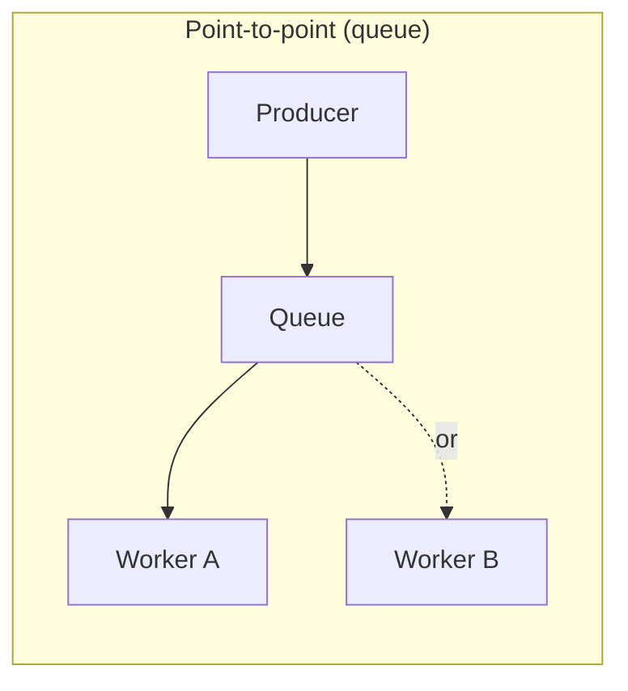
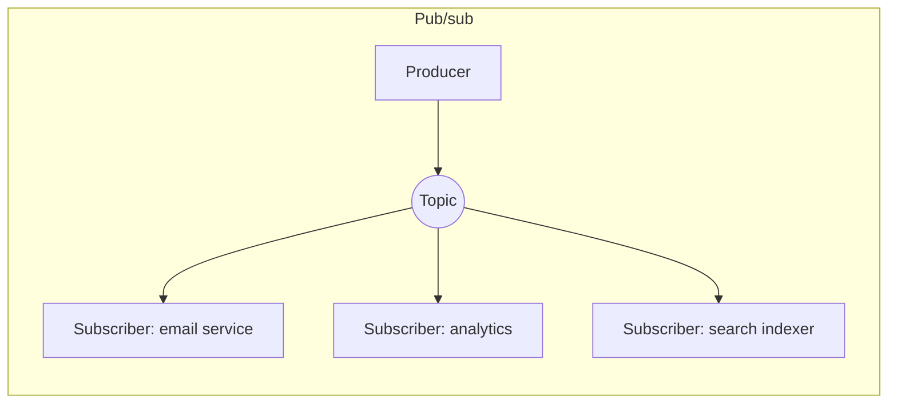

# 6. Message Queues & Async Processing

So far everything has been request/response: ask, wait, get an answer.
Message queues break that pattern -- they let one part of a system hand
off work to another *without waiting around for it to finish*.

## What It Is

- A **message queue** is a durable, ordered (usually) buffer that sits
  between a **producer** (creates work/events) and a **consumer**
  (processes them), decoupling the two.
- The producer doesn't call the consumer directly -- it drops a message
  on the queue and moves on. The consumer picks messages up whenever
  it's ready.
- **Async processing**: doing work outside the request/response cycle,
  typically triggered by a queued message, so the original caller isn't
  stuck waiting for slow work (sending an email, resizing a video,
  generating a report).

## Analogy

> A restaurant's order ticket rail. The waiter (producer) writes an
> order and clips it to the rail (queue) -- they don't stand at the
> grill waiting for it to be cooked. The cooks (consumers) pull tickets
> off the rail when they have capacity, in roughly the order they came
> in. If a cook falls behind, tickets pile up on the rail instead of
> the waiter getting stuck; the queue absorbs the mismatch in speed.

## How It Works

### Point-to-point vs pub/sub

- **Point-to-point (queue)**: each message is consumed by exactly *one*
  consumer, even if there are several workers pulling from the same
  queue (they compete for messages -- good for distributing a workload).
- **Pub/sub (publish/subscribe)**: a message (often called an "event")
  published to a **topic** is delivered to *every* subscriber
  independently -- good for "notify everyone who cares" rather than
  "get this one thing done."

### Event-driven architecture

- Instead of Service A calling Service B directly, Service A publishes
  "order placed" as an event; any number of services can subscribe
  without Service A ever knowing they exist.
- This is a big deal for decoupling: you can add a new subscriber (say,
  a fraud-detection service) without touching Service A at all.
- Tradeoff: harder to trace "what happens when an order is placed?"
  since the logic is now spread across independent subscribers instead
  of one call stack.

### Delivery guarantees

| Guarantee | Meaning | Cost |
|---|---|---|
| At-most-once | Message delivered 0 or 1 times -- may be lost | Cheapest, riskiest |
| At-least-once | Message delivered 1+ times -- may be duplicated | Most common default |
| Exactly-once | Delivered exactly once, no loss, no duplicates | Expensive, often approximated |

- Because "exactly-once" is genuinely hard in distributed systems, most
  real systems use **at-least-once delivery** and make consumers
  **idempotent** (processing the same message twice has the same
  effect as once) -- cheaper than solving exactly-once delivery
  directly.

### Why not just call the other service directly?

- Synchronous calls mean the caller is blocked (and fails) if the
  callee is slow or down. A queue absorbs that: the message just waits
  until the consumer is ready.
- Queues also naturally smooth out traffic spikes -- a sudden burst of
  10,000 events queues up and gets processed at a steady rate instead
  of falling over the consumer all at once.

## Why It Matters

- Async processing is the standard answer to "this operation is slow
  and the user shouldn't have to wait for it" (e.g. "send a
  confirmation email after signup" should never block the signup
  response).
- Message queues are the backbone of microservice architectures --
  decoupling services via events is usually preferred over a tangle of
  direct synchronous calls.
- "At-least-once + idempotent consumer" is a pattern you'll reach for
  constantly; interviewers like hearing you name the tradeoff instead
  of hand-waving "it just works."

## Quiz

1. A user signs up and the system needs to send a welcome email. Why
   is doing this via a queue better than sending the email
   synchronously during the signup request?
   

Show answer

   Email delivery can be slow or occasionally fail (a flaky third-party
   provider), and the user shouldn't have to wait for it, or have their
   signup fail, just because email sending is having a bad moment.
   Queuing it means the signup response returns immediately, and the
   email gets sent (with retries if needed) independently.
   

2. What's the core difference between a point-to-point queue and a
   pub/sub topic?
   

Show answer

   In point-to-point, each message is consumed by exactly one consumer
   -- multiple workers compete for messages, splitting up the workload.
   In pub/sub, each message (event) is delivered independently to every
   subscriber of the topic -- it's "broadcast," not "whoever grabs it
   first."
   

3. Why do most real-world systems favor at-least-once delivery plus
   idempotent consumers, rather than trying to build exactly-once
   delivery?
   

Show answer

   Exactly-once delivery across a network, where both messages and
   acknowledgments can be lost or duplicated, is fundamentally hard to
   guarantee. It's far cheaper and more reliable to accept that a
   message might be delivered more than once (at-least-once) and design
   the consumer so processing it twice has the same effect as
   processing it once (idempotency) -- e.g. by checking "have I already
   processed this message ID?" before acting.
   

4. In an event-driven architecture, Service A publishes "order placed"
   and five other services subscribe to it. What's the cost of this
   flexibility?
   

Show answer

   It becomes harder to reason about "what happens when an order is
   placed?" -- that logic is now scattered across five independently
   deployed, independently failing subscriber services instead of one
   traceable call stack. Debugging and monitoring event-driven systems
   typically requires extra tooling (distributed tracing, event logs)
   to compensate for that lost visibility.
   

5. A queue starts backing up (messages arriving faster than consumers
   process them). What are two different ways you could respond, and
   what do they trade off?
   

Show answer

   (a) Scale out consumers horizontally (more workers pulling from the
   queue) -- costs more compute but fixes the underlying throughput gap.
   (b) Apply backpressure or rate limiting upstream (make producers slow
   down or reject new work) -- protects the consumers but pushes the
   problem back to whoever's producing, potentially degrading their
   experience (see [rate limiting](07-rate-limiting.md)).
   

