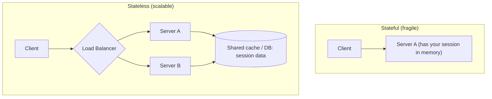

# 10. Scalability Patterns: Vertical vs Horizontal, Statelessness, Microservices vs Monoliths

This is the capstone topic -- it ties together load balancing, caching,
databases, and statelessness into the big-picture question: "how does
this system grow as traffic grows?"

## What It Is

- **Scalability**: a system's ability to handle growing load (more
  users, more data, more requests) by adding resources, ideally without
  a redesign.
- **Vertical scaling (scale up)**: make a single server bigger (more
  CPU, RAM, faster disk).
- **Horizontal scaling (scale out)**: add more servers, and distribute
  load across them (this is where [load balancing](02-load-balancing.md)
  comes in).
- **Statelessness**: designing servers to hold no client-specific data
  between requests, so any server can handle any request -- the
  property that makes horizontal scaling actually work smoothly.

## Analogy

> Vertical scaling is hiring one genius who works faster and faster
> (eventually there's a limit to how fast one person can go, and
> geniuses are expensive). Horizontal scaling is hiring more regular
> workers and splitting the work between them (in principle, unlimited
> -- but only if any worker can pick up any task, i.e. nobody has
> secret private knowledge only they possess -- that "secret private
> knowledge" is exactly what statelessness eliminates).

## How It Works

### Vertical vs horizontal, side by side

| | Vertical (scale up) | Horizontal (scale out) |
|---|---|---|
| How | Bigger machine | More machines |
| Ceiling | Hard physical/cost limit (biggest machine money can buy) | Much higher, in principle near-unlimited |
| Complexity | Simple -- no architecture change needed | Requires load balancing, statelessness, often data partitioning |
| Failure mode | Single point of failure (one big box) | One server dying barely dents total capacity |
| Typical path | Good early / for stateful things hard to distribute (e.g. a single large database) | Standard approach for application servers at scale |

Most real systems do both: horizontally scaled, stateless application
servers in front of a vertically-scaled (and then eventually sharded)
database.

### Statelessness in practice

- Stateless servers store session/user data in a shared external store
  (a cache like Redis, or the database) instead of local memory, so
  *any* server behind the load balancer can serve *any* request.
- This is what lets you add or remove servers freely (autoscaling) and
  lets a load balancer route with simple algorithms like round robin
  instead of needing sticky sessions.

### Monolith vs microservices

- **Monolith**: the entire application is one deployable unit -- one
  codebase, one build, one deploy. Simple to develop and reason about
  early on; scales (horizontally) by running more copies of the whole
  thing.
- **Microservices**: the application is split into independently
  deployable services (e.g. a user service, an order service, a
  notification service), often communicating over the network (REST,
  RPC, or via [message queues](06-message-queues.md)).

| | Monolith | Microservices |
|---|---|---|
| Early-stage velocity | Faster -- one codebase, no network calls between features | Slower -- overhead of service boundaries, deployment complexity |
| Scaling | Scale the whole app together, even if only one part is hot | Scale just the hot service independently |
| Team structure | Works fine for one team | Shines when multiple teams need to ship independently |
| Failure isolation | One bug can take down everything | A failing service can (if designed well) degrade gracefully instead of taking everything down |
| Operational cost | Low | High -- service discovery, distributed tracing, more infrastructure |

- Common trajectory: start as a monolith (fast to build, easy to
  reason about), split out microservices later *only* where there's a
  real, demonstrated need (a hot spot that needs independent scaling, or
  a team boundary that needs independent deploys) -- not preemptively.

## Why It Matters

- "How does this scale?" is close to the central question of every
  system design interview -- vertical vs horizontal, and stateless vs
  stateful, is the vocabulary you use to answer it precisely.
- Microservices are often over-prescribed in interviews and in real
  companies -- being able to say "a monolith would actually be fine
  here, and simpler" is a mark of judgment, not a lack of knowledge.
- Statelessness is the connective tissue between this topic and load
  balancing, caching, and databases -- it's the property that makes all
  of those other techniques compose cleanly together.

## Quiz

1. Why does horizontal scaling have a much higher ceiling than vertical
   scaling, in principle?
   

Show answer

   Vertical scaling is capped by the biggest single machine you can
   build or buy -- there's a hard physical and cost ceiling. Horizontal
   scaling just adds more machines, and (assuming the architecture
   supports it -- statelessness, data partitioning) there's no
   fundamental limit to how many machines you can add, only cost and
   coordination overhead.
   

2. A server keeps a user's shopping cart in local memory. What
   specifically breaks when you try to horizontally scale this service
   behind a plain round-robin load balancer?
   

Show answer

   The user's next request might be routed to a different server than
   the one holding their cart in memory, so that server has no idea
   the cart exists -- the user sees an empty cart. Fixing it requires
   moving cart state out of server-local memory into a shared store
   (cache or database) that every server can read, making the servers
   themselves stateless.
   

3. A startup with one small team is building their first product.
   Would you recommend starting with microservices, and why or why
   not?
   

Show answer

   Generally no -- a monolith is usually the better starting point.
   With one team and an unproven product, the overhead of
   microservices (service boundaries, network calls, distributed
   deployment/monitoring) slows down iteration without a corresponding
   benefit, since there's no team-boundary or independent-scaling need
   yet. Split out services later, driven by an actual measured need.
   

4. What's one scenario where splitting out a single microservice from
   a monolith is clearly justified?
   

Show answer

   A hot spot: e.g. one feature (like image processing or search) has
   dramatically different resource needs or traffic patterns than the
   rest of the app, so scaling the whole monolith just to give that one
   feature more capacity wastes resources. Extracting it lets you scale
   (and deploy) that piece independently. Another common justification:
   multiple teams need to ship independently without coordinating
   releases on a shared codebase.
   

5. Why is statelessness described as the property that makes load
   balancing, caching, and horizontal scaling "compose cleanly
   together"?
   

Show answer

   Because it removes the assumption that "this specific server knows
   something no other server does." Once that's true, a load balancer
   can route any request anywhere (no sticky sessions needed), caches
   can be shared external stores any server can hit, and adding or
   removing servers becomes a routine operational action rather than a
   risky one -- all three techniques rely on servers being
   interchangeable.
   

