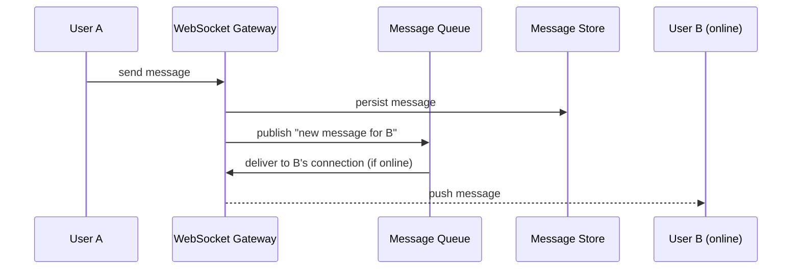

# Design a Chat Application

Introduces real-time delivery, which most of the earlier topics don't
directly cover -- a good test of how you extend request/response
thinking to "the server needs to push to me."

## The Prompt

Design a one-on-one and group messaging app (like WhatsApp or Slack
DMs): users send messages that are delivered to recipients in near
real time, with message history persisted.

## Clarifying Questions to Ask First

- One-on-one only, or group chats too?
- Does it need to work when the recipient is offline (store-and-forward
  until they reconnect)?
- Read receipts / "seen" / "typing" indicators required?
- What's the durability expectation -- can a message ever be lost?
- Multi-device support (same account, phone + laptop, both should see
  messages)?
- Expected scale: concurrent connected users, messages/sec.

## Your Approach

_Write your own design here before looking at the reference approach
below._

```
(your notes)
```

## Reference Approach

<details>
<summary>Show reference approach</summary>

**Why plain request/response doesn't work here**

The server needs to *push* a new message to a recipient who isn't
actively asking for it. Options:
- **WebSockets**: a persistent, bidirectional connection -- the standard
  choice for chat. The server can push the instant a message arrives.
- **Long polling**: client makes a request that the server holds open
  until there's new data (or a timeout) -- a fallback for
  environments where WebSockets aren't available.
- **Push notifications**: for when the app isn't even open (mobile
  push via APNs/FCM).

**High-level flow**



**Connection management**

- A fleet of WebSocket gateway servers hold open connections. Since a
  connection is inherently stateful (tied to one server), this is one
  of the rare cases where you *can't* just make servers fully
  stateless -- instead, maintain a lookup (in Redis) of `user_id ->
  which gateway server they're connected to`, so any server that needs
  to deliver a message to that user knows where to route it.

**Delivery when the recipient is offline**

- Store the message durably first (message store / database), *then*
  attempt real-time delivery.
- If the recipient is offline, nothing further happens at send time --
  when they reconnect, the client fetches undelivered messages (or a
  recent history window) from the message store directly.
- This is a store-and-forward pattern: the message queue is really just
  the store, and "delivery" is really "sync on reconnect" plus
  "real-time push if already connected."

**Data model**

- Messages keyed by conversation ID, ordered by timestamp/sequence
  number -- a wide-column or document store (per-conversation message
  list) fits this access pattern well (see [databases](../04-databases.md)).
- Conversation ID for a 1:1 chat is often a deterministic combination
  of both user IDs; for group chats, a separate conversation/group
  entity.

**Consistency considerations**

- Message ordering within a single conversation matters a lot (users
  notice out-of-order messages) -- ensure a single ordering authority
  per conversation (e.g. a sequence number assigned at write time), even
  if delivery to different recipients happens at slightly different
  moments. See [consistency models](../05-consistency-models.md):
  this system generally favors availability (always accept a message
  to send) with eventual delivery, rather than blocking sends on strict
  global ordering guarantees.

**Multi-device support**

- Track connections per-device, not just per-user, so all of a user's
  active devices receive pushes; the "gateway lookup" becomes
  `user_id -> [list of connected gateway/device pairs]`.

</details>
