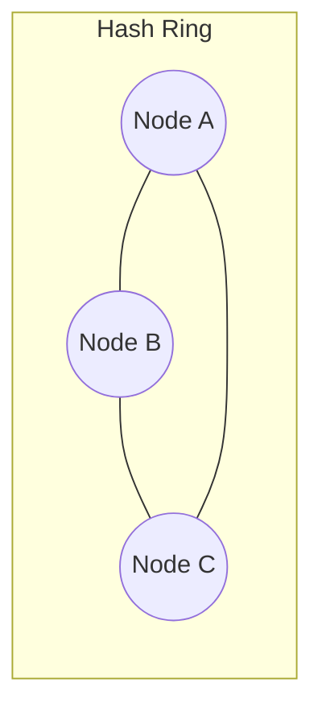
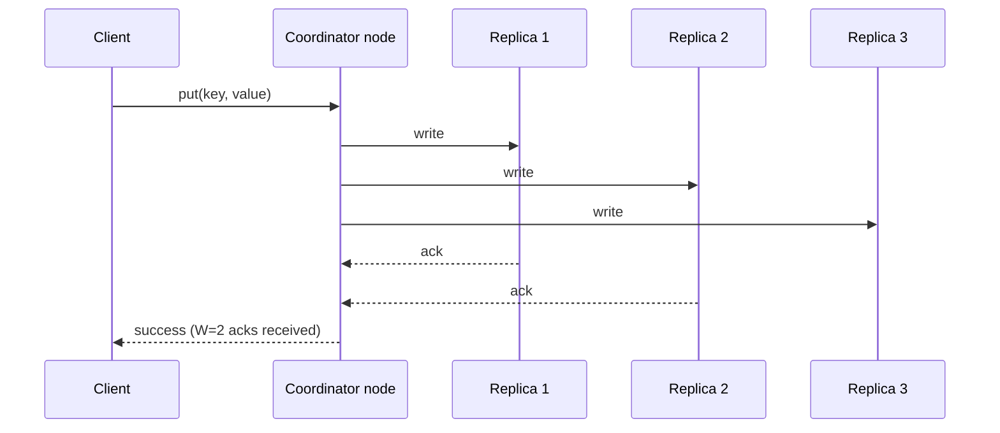

# Design a Distributed Key-Value Store

The most "infrastructure-y" of the practice problems -- effectively
designing a simplified version of something like DynamoDB or Redis
Cluster, and a great forcing function for the CAP theorem.

## The Prompt

Design a distributed key-value store: clients can `put(key, value)` and
`get(key)`, and the system must stay available and scale horizontally
across many machines.

## Clarifying Questions to Ask First

- What are the value sizes and overall data volume? (Small values like
  session tokens vs. large blobs changes the design a lot.)
- What consistency guarantees are needed -- strong, or is eventual
  acceptable?
- Read-heavy, write-heavy, or balanced?
- Does data need to survive a full datacenter/region failure?
- Any need for range queries, or strictly single-key get/put?

## Your Approach

_Write your own design here before looking at the reference approach
below._

```
(your notes)
```

## Reference Approach

<details>
<summary>Show reference approach</summary>

**Partitioning (sharding) the keyspace**

- Use **consistent hashing** rather than a simple `hash(key) % N`:
  arrange nodes and keys on a conceptual hash ring, and each key belongs
  to the next node clockwise on the ring. This means adding/removing a
  node only reshuffles a small fraction of keys (roughly `1/N`), instead
  of nearly all of them like a naive modulo scheme would on every
  resize. See [databases: sharding](../04-databases.md) for the general
  concept this specializes.



**Replication**

- Each key is stored on the node it hashes to *and* its next N-1
  neighbors on the ring (replication factor N, e.g. N=3) -- so losing
  any single node doesn't lose data.

**Consistency: this is where CAP becomes concrete**

- Favor availability (an **AP** system, in CAP terms -- see
  [consistency models](../05-consistency-models.md)): always accept
  reads/writes even if some replicas are unreachable, and let replicas
  converge afterward.
- Use tunable **quorum** reads/writes: e.g. with replication factor 3,
  require 2 acknowledgments for a write (W=2) and read from 2 replicas
  (R=2). Since `W + R > N`, a read is guaranteed to overlap with the
  most recent write's replicas, giving strong-ish consistency without
  requiring *all* replicas to respond.

**Conflict resolution**

- With an AP design, two replicas can end up with different values for
  the same key after a partition heals (both accepted writes
  independently). Options:
  - **Last-write-wins**: attach a timestamp, keep the newest -- simple,
    but can silently discard a legitimate concurrent write.
  - **Vector clocks**: track causal history per replica so the system
    can detect genuine conflicts (rather than just picking "newest") and
    surface them for resolution (by the client or a merge function).

**Read/write path**



**Handling node failure**

- Health checks detect a dead node (similar mechanism to [load
  balancer health checks](../02-load-balancing.md)); the ring
  reroutes its key range to the next node.
- **Hinted handoff**: if a node is briefly unreachable during a write, a
  neighboring node temporarily stores the write on its behalf and
  hands it off once the original node recovers -- keeps writes
  succeeding through short, transient failures.

**Scale considerations**

- Storage engine per node is typically an LSM-tree (log-structured
  merge-tree) for write-heavy workloads, or a B-tree for read-heavy --
  same fundamental tradeoff as database [indexing](../04-databases.md),
  just at the single-node storage layer.

</details>
