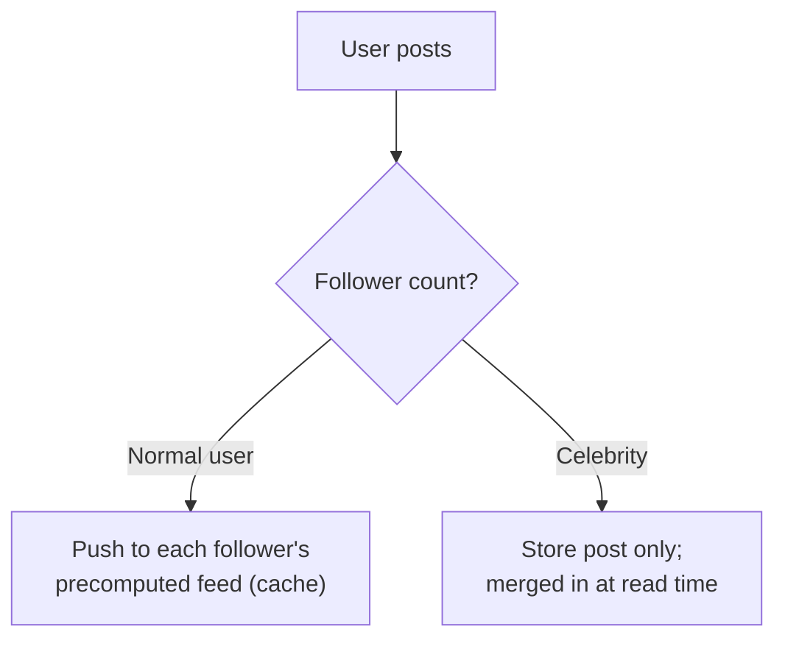

# Design a News Feed

A classic "fan-out" problem -- the interesting tension is between
computing a feed on read vs. pre-computing it on write.

## The Prompt

Design a social media news feed (like Instagram or Twitter/X's home
timeline): users follow other users, and see a reverse-chronological
(or ranked) feed of posts from people they follow.

## Clarifying Questions to Ask First

- Reverse-chronological, or ranked/algorithmic feed?
- What's the follower distribution like -- mostly small friend counts,
  or do some accounts have millions of followers (celebrities)?
- How fresh does the feed need to be (can it lag by seconds? minutes?)?
- Do we need to support editing/deleting posts and have that reflect
  in feeds already generated?
- Expected scale: posts/sec, feed reads/sec, average + max
  followers-per-user.

## Your Approach

_Write your own design here before looking at the reference approach
below._

```
(your notes)
```

## Reference Approach

<details>
<summary>Show reference approach</summary>

**The core design fork: fan-out on write vs. fan-out on read**

- **Fan-out on write (push)**: the moment a user posts, immediately
  insert that post into the precomputed feed of *every one of their
  followers*. Reading a feed is then just "read my precomputed feed" --
  very fast reads.
- **Fan-out on read (pull)**: store posts once; when a user requests
  their feed, fetch recent posts from everyone they follow and merge
  them on the fly. Slower reads, but writes are cheap (post once,
  done).

**Why you need both, in practice (the celebrity problem)**

- Fan-out on write breaks down for accounts with millions of followers
  -- one post would require millions of feed insertions, which is both
  slow and wasteful if most of those followers never even check their
  feed before the post is stale.
- The common real-world hybrid: fan-out on write for regular users
  (most accounts have modest follower counts, so this is cheap and
  keeps reads fast), but fan-out on read for celebrity/high-follower
  accounts -- their posts are merged in at read time instead of
  pre-pushed everywhere.



**Data model**

- Posts stored once, keyed by post ID, in a database (or object store
  for media) -- see [databases](../04-databases.md).
- Each user's precomputed feed: a capped, time-ordered list of post IDs
  in a fast store (Redis sorted set is a common choice -- ranked by
  timestamp).

**Read path**

- Normal case: read the user's precomputed feed (cache hit, fast).
- Merge in celebrity posts: fetch recent posts from any celebrity
  accounts they follow, merge by timestamp with the precomputed feed at
  read time.

**Handling deletes/edits**

- A deleted post needs to disappear from every precomputed feed it was
  pushed into -- in practice, many systems store only the post ID in
  feeds and look up the live post at read time, so a deleted post
  simply resolves to "not found" and gets filtered, rather than
  requiring an active removal fan-out.

**Consistency**

- This is a strong candidate for [eventual consistency](../05-consistency-models.md)
  -- it's completely acceptable for a new post to take a few seconds to
  show up in all followers' feeds. Trying to guarantee instant, strongly
  consistent feed updates for millions of followers isn't worth the
  cost.

**Scale considerations**

- Fan-out on write is a great fit for [async processing via a queue](../06-message-queues.md):
  the post-creation request returns immediately, and a background
  worker handles pushing the post into followers' feeds.

</details>
