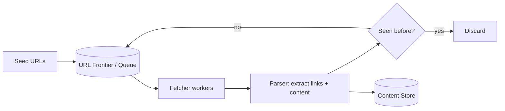

# Design a Web Crawler

A good "batch/offline system" problem, as a contrast to the mostly
online/real-time problems elsewhere in this set.

## The Prompt

Design a web crawler that starts from a set of seed URLs, downloads
pages, extracts links, and recursively crawls them -- at the scale of
billions of pages (think: building a search engine's index).

## Clarifying Questions to Ask First

- What's the goal of the crawl -- full-text indexing, link analysis,
  monitoring specific sites for changes?
- How do we handle `robots.txt` and politeness (not hammering one
  domain with requests)?
- Do we need to detect and avoid duplicate content (mirrors, near-
  identical pages)?
- How fresh does content need to be -- crawl each page once, or
  periodically re-crawl for updates?
- Scale: how many pages, and over what time budget?

## Your Approach

_Write your own design here before looking at the reference approach
below._

```
(your notes)
```

## Reference Approach

<details>
<summary>Show reference approach</summary>

**High-level pipeline**



**The URL frontier (the core data structure)**

- Not just a plain FIFO queue -- it needs to enforce **politeness**
  (don't send 1,000 concurrent requests to the same small domain) and
  **prioritization** (some pages should be crawled/re-crawled sooner
  than others).
- Common approach: multiple sub-queues, one per domain (or host), each
  rate-limited independently (see [rate limiting](../07-rate-limiting.md)
  applied *outbound*, protecting the sites being crawled rather than
  protecting the crawler itself) -- a scheduler pulls from sub-queues
  round-robin, respecting each domain's crawl-delay.

**Fetcher workers**

- A large, horizontally-scaled pool of workers pulls URLs from the
  frontier, downloads the page, respects `robots.txt` rules for that
  domain (fetched and cached per-domain, not re-fetched every time).
- DNS lookups are a real bottleneck at this scale -- a local DNS cache
  in front of the fetchers avoids repeatedly resolving the same
  frequently-crawled domains (a specific instance of [caching](../03-caching.md)).

**Duplicate detection**

- Two levels of "duplicate": the same URL seen twice (easy: check a
  seen-URL set/store before enqueueing), and different URLs with
  near-identical *content* (mirrors, tracking-parameter variants of the
  same page).
- URL-level dedup: a large, fast-lookup set (e.g. a Bloom filter for a
  cheap, memory-efficient "have I probably seen this?" check, backed by
  an authoritative store for the rare false positives a Bloom filter can
  produce).
- Content-level dedup: hash the extracted page content (e.g.
  simhash/minhash for near-duplicate detection, not just exact-match
  hashing) and skip storing/reprocessing near-identical pages.

**Storage**

- Raw page content: a large, cheap, mostly-append-only object store
  (not a relational database -- content is large, unstructured, and
  accessed by ID, not queried relationally).
- Metadata (URL, crawl timestamp, content hash, outgoing links): a
  separate store optimized for lookups and link-graph traversal.

**Recrawling / freshness**

- Not every page needs the same recrawl frequency -- a news homepage
  changes hourly, a static "About Us" page almost never does. Assign a
  recrawl priority/interval per URL based on observed change frequency,
  and feed due-for-recrawl URLs back into the frontier on a schedule.

**Scale considerations**

- This is fundamentally a horizontally-scaled, mostly-stateless batch
  pipeline (see [scalability patterns](../10-scalability-patterns.md))
  -- the frontier and dedup stores are the shared state that needs
  careful design (partitioned, e.g. by domain hash, across many
  machines), while fetcher/parser workers themselves are easy to scale
  out since they hold no state between URLs.
- Estimate frontier size and storage growth using [back-of-envelope
  estimation](../09-back-of-envelope-estimation.md) -- at billions of
  pages, even small per-page metadata adds up to a genuinely large
  sharding/storage problem.

</details>
